# CUDA Path Tracer

**University of Pennsylvania, CIS 5650: GPU Programming and Architecture,
Project 3 - CUDA Path Tracer**

* **Jing Huang**
  * [GitHub](https://github.com/Stabil1ze)
* Tested on: Windows 11, Intel i7-12700H @ 2.30GHz 23GB,
  NVIDIA GeForce RTX 3060 Laptop GPU 6GB (Personal computer)

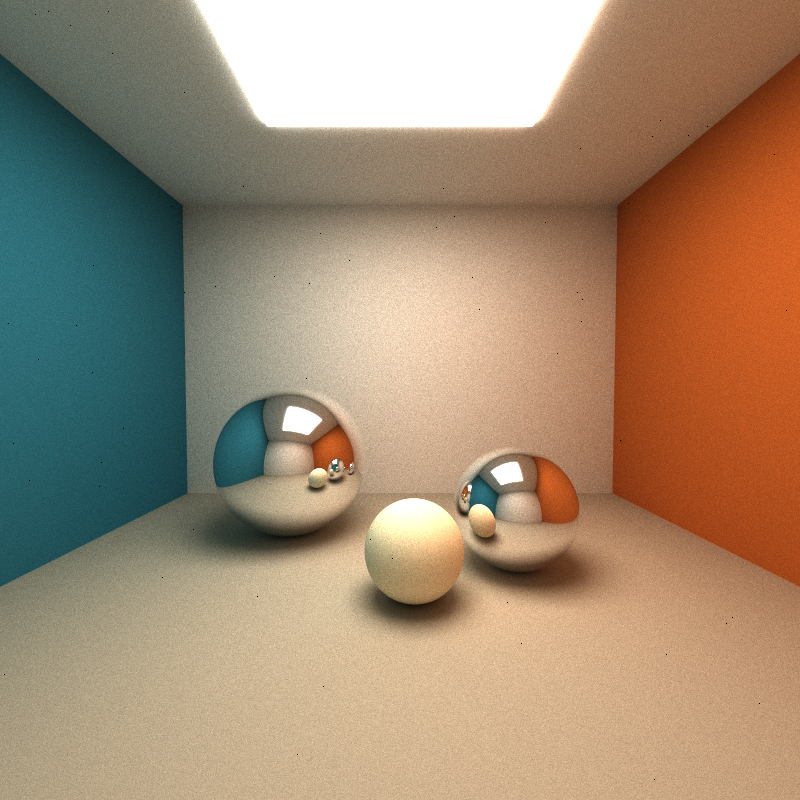

*A closed room lit by a 5x5 ceiling light with three mirror spheres: global
illumination (the teal and orange walls bleed onto the floor and onto the balls),
one-bounce mirror reflections and soft shadowing. `scenes/showcase.json`,
800x800, 3000 samples, 3m55s on the RTX 3060 Laptop.*

## Overview

The CIS 5650 base code provides the framework - JSON scene loading, primitive
intersections, the CUDA-OpenGL interop preview and image saving. Everything that
turns it into a renderer is implemented here: the BSDF shading kernel, the
bounce loop, anti-aliasing, stream compaction, a thin lens camera and the
procedural shapes and textures.

| # | Feature | File |
|---|---|---|
| 1 | BSDF shading kernel: ideal diffuse (cosine weighted) + perfect specular, dispatched per material | `src/interactions.cu`, `src/pathtrace.cu` |
| 2 | Material loading driven by `TYPE` / `ROUGHNESS` (the base `Specular` branch threw `ROUGHNESS` away) | `src/scene.cpp` |
| 3 | Stochastic sampled anti-aliasing (sub-pixel jitter, compile-time toggle `STOCHASTIC_AA`) | `src/pathtrace.cu` |
| 4 | Stream compaction of terminated paths - map / scan / scatter built on the work-efficient scan from my Project 2 | `src/pathtrace.cu`, `stream_compaction/` |
| 5 | Emitter hits accumulate straight into the image, which is what allows terminated paths to be dropped | `src/pathtrace.cu` |
| 6 | Per-bounce ray counting for the analysis (`[profile] ...` on stdout) | `src/pathtrace.cu` |
| 7 | Physically based depth of field: thin lens camera driven by two optional scene fields (`APERTURE`, `FOCUS`), off by default | `src/pathtrace.cu`, `src/scene.cpp` |
| 8 | Camera basis and orbit camera fixes (the base code mirrored the pitch and put the eye below the floor whenever a scene looked downwards) | `src/scene.cpp`, `src/main.cpp` |
| 9 | Procedural shapes: a power-8 Mandelbulb and a Menger sponge, signed distance fields intersected by sphere tracing with a bounding sphere broad phase | `src/intersections.cu` |
| 10 | Procedural textures: checker and marble, evaluated on the object space hit point so they work on any shape | `src/interactions.cu` |
| 11 | Restartable rendering: the accumulation buffer and sample count are checkpointed to `<FILE>.ckpt` and picked up again on the next start | `src/pathtrace.cu`, `src/main.cpp` |
| 12 | Russian roulette: paths are killed with a probability that grows as their throughput shrinks, and the survivors are divided by the survival probability | `src/pathtrace.cu` |
| 13 | Refraction: a smooth dielectric BSDF with Schlick Fresnel, total internal reflection and the radiance scaling of a refractive interface | `src/interactions.cu`, `src/scene.cpp` |
| 14 | Glossy specular: a GGX microfacet lobe with Smith masking-shadowing and importance sampling of the visible normal distribution | `src/ggx.h`, `src/interactions.cu` |
| 15 | Low-discrepancy sampling: a scrambled Halton sequence for the pixel area and the lens, kept off the path dimensions after measuring both | `src/sampling.h`, `src/pathtrace.cu` |
| 16 | Direct light sampling (next event estimation): every diffuse vertex is connected to a random point on the surface of a random light, with a shadow ray and a ledger that measures what the estimator delivers against what it replaced | `src/pathtrace.cu` |

The two features that change the image (#3, #4) are behind `#define`s
(`STOCHASTIC_AA`, `STREAM_COMPACTION`), so every number below can be reproduced by
flipping one line and rebuilding; #7 is off unless a scene asks for it, so the
pinhole path stays bit-identical to what the previous sections measured.

## Implementation

### BSDF shading kernel

`scatterRay` picks one BSDF lobe per bounce with a probability proportional to its
weight and divides the throughput by that probability, which keeps the estimator
unbiased; today the weights are 0/1 (a material is either diffuse or a mirror),
but the same code handles mixed materials such as
`glossy = diffuse + imperfect specular`:

```cpp
if (u01(rng) < diffuseWeight / weightSum) {
    direction = calculateRandomDirectionInHemisphere(normal, rng);
    weight    = m.color * (diffuseWeight / probability);
} else {
    direction = glm::reflect(glm::normalize(pathSegment.ray.direction), normal);
    weight    = m.specular.color * (specularWeight / probability);
}
```

For the diffuse lobe the cosine term and the sampling pdf cancel exactly
(`BRDF = albedo / PI`, `pdf = cos(theta) / PI`, so `BRDF * cos / pdf = albedo`),
which is why cosine-weighted sampling is both cheap and low variance. The specular
lobe is a delta distribution, so its `BRDF * cos / pdf` collapses to the
reflectance itself.

The shading kernel (`shadeMaterials`) has four exits, and the exact semantics
matter for stream compaction:

* ray escaped the scene -> contribution zero, path terminated,
* ray hit an emitter -> `throughput * color * emittance` is added to the image and
  the path is terminated,
* surface hit but the bounce budget is used up -> contribution zero, terminated,
* otherwise `scatterRay` runs and the budget is decremented.

`remainingBounces` is the three-state bookkeeping: `> 0` alive and scattering,
`== 0` alive but only able to still see an emitter (the last segment), `< 0`
terminated - and `< 0` is exactly the predicate stream compaction removes.

Swapping the Cornell box's sphere from `Specular` to `Diffuse` isolates what the
specular branch adds (same scene, same seed, same sample count):

| diffuse sphere (no specular lobe) | perfect specular sphere |
|---|---|
| 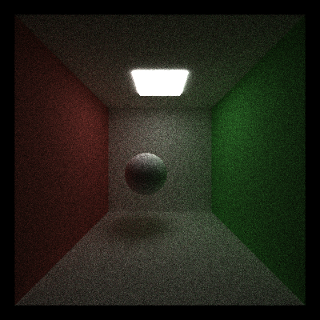 | 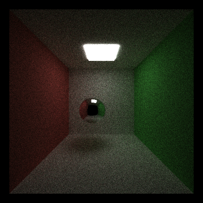 |

### Stochastic sampled anti-aliasing

The first ray of every pixel used to be aimed at a single fixed point. Jittering
that point inside the pixel turns the per-pixel value into a Monte Carlo estimate
of the radiance *averaged over the pixel area* (a box filter), which is what
removes the stair-stepping on silhouettes:

```cpp
// the integer grid coordinate of this base code addresses the pixel *corner*
// (at x = 0 the offset is exactly the left edge of the view), so the pixel area
// is [x, x+1) and the jitter has to span [0, 1)
float sampleX = (float)x;
float sampleY = (float)y;

// depth tag -1 gives the camera ray a random stream of its own
thrust::default_random_engine rng = makeSeededRandomEngine(iter, index, -1);
thrust::uniform_real_distribution<float> u01(0.0f, 1.0f);

#if STOCHASTIC_AA
    sampleX += u01(rng);
    sampleY += u01(rng);
#endif
```

Two details are easy to get wrong. The depth tag `-1` gives the camera ray its own
random stream - bounce `d` draws with tag `d`, so reusing tag `0` would make the
sub-pixel offset and the first scatter direction share the same random numbers.
And the offset has to cover `[0, 1)` rather than `[-0.5, 0.5)`: with a `+/- 0.5`
jitter a pixel also samples half of its neighbour, which behaves like a box filter
shifted by half a pixel and measurably does *not* reduce the error against a
supersampled reference.

The camera random stream is created unconditionally (and the jitter only drawn
under `#if STOCHASTIC_AA`) because the depth of field below reuses the same stream:
with `STOCHASTIC_AA` off the two draws then go to the lens sample instead of being
wasted.

### Stream compaction

Every bounce, the paths that terminated are removed from the working arrays
(`map -> scan -> scatter`) so the next bounce only launches threads for rays that
can still reach a light:

```cpp
kernMarkAlivePaths<<<blocks, blockSize>>>(numPaths, dev_alive, paths);   // predicate
int m = nextPowerOfTwoAtLeast(numPaths + 1);
cudaMemcpy(dev_scanIndices, dev_alive, numPaths * sizeof(int), cudaMemcpyDeviceToDevice);
cudaMemset(dev_scanIndices + numPaths, 0, (m - numPaths) * sizeof(int));
StreamCompaction::Efficient::scanDevice(m, dev_scanIndices);             // Project 2 scan
kernScatterAlivePaths<<<blocks, blockSize>>>(...);                       // PathSegment[]
kernScatterAliveIntersections<<<blocks, blockSize>>>(...);               // ShadeableIntersection[]
```

* The scan is my Project 2 work-efficient (Blelloch) scan, copied into
  `stream_compaction/`. It runs in place on a power-of-two array with a zeroed
  tail, so the predicate is copied into a padded buffer first.
* The survivor count comes for free: the exclusive prefix sum at `[numPaths]` is
  the total, which saves a separate reduction. That is why the scan buffer is
  `nextPowerOfTwoAtLeast(numPaths + 1)`.
* `PathSegment` and `ShadeableIntersection` are mirrored arrays and are scattered
  with the same index map to stay in sync. The scatter goes into a second set of
  buffers which are then swapped in: element `i` moves to `indices[i] <= i`, so
  scattering in place would race with threads that have not read their element
  yet.
* Radiance is added to the image with `atomicAdd` at the moment a ray hits an
  emitter. The base code's `finalGather` pass over the path array cannot be kept:
  by then the very paths that carry radiance have been compacted away.

Stream compaction is a pure optimization - with it enabled the image is
**bit-identical** to rendering with it disabled (`RMSE = 0` over the whole 800x800
image), because the RNG seed is `(iteration, pixelIndex, depth)` and does not
depend on the array slot a path happens to live in.

### Depth of field

A pinhole camera is sharp at every distance. The thin lens model replaces the
single eye point with a disk of radius `APERTURE` and aims every ray at the point
where the *pinhole* ray crosses the focal plane at distance `FOCUS`, so a point at
exactly that distance is still imaged to a single point no matter where on the
lens the ray started:

```cpp
// pinholeDirection is the direction the camera would fire with aperture == 0
if (cam.aperture > 0.0f && cam.focalDistance > 0.0f)
{
    float radius = cam.aperture * sqrtf(u01(rng));   // sqrt = uniform over the disk
    float angle  = TWO_PI * u01(rng);
    glm::vec3 lensPoint  = cam.position
        + cam.right * (radius * cosf(angle))
        + cam.up    * (radius * sinf(angle));
    glm::vec3 focalPoint = cam.position + pinholeDirection * cam.focalDistance;

    segment.ray.origin    = lensPoint;
    segment.ray.direction = glm::normalize(focalPoint - lensPoint);
}
else
{
    segment.ray.origin    = cam.position;
    segment.ray.direction = pinholeDirection;
}
```

The square root is what makes the samples uniform over the *area* of the disk
rather than clumped around its centre, and drawing `radius` and `angle` from the
same camera-ray stream that anti-aliasing uses means the pixel position and the
lens position vary together over the iterations - the estimator becomes an average
over the pixel *and* over the lens. Because both random numbers are always drawn
in this branch, switching anti-aliasing off simply hands two draws to the lens
sample instead of wasting them.

Two optional fields were added to the scene format:

| field | meaning | default |
|---|---|---|
| `APERTURE` | lens radius in world units, `0` keeps the camera a pinhole | `0` |
| `FOCUS` | distance of the focal plane | `\|lookAt - position\|` |

`FOCUS` defaults to the distance of the look-at point, i.e. "the thing I am looking
at is in focus", and `APERTURE` defaults to a pinhole - so every scene written
before this feature, and every measurement in this README, keeps rendering through
the original pinhole path. The blur of a point at distance `z` is a disk of
diameter

$$
c = 2 \cdot \text{aperture} \cdot \frac{|z - \text{FOCUS}|}{z}
$$

world units at that depth (similar triangles between the lens and the focal
plane), which grows linearly with the aperture and is asymmetric around the focus
plane: at a fixed aperture an object twice as far away is blurred half as much as
one twice as close.

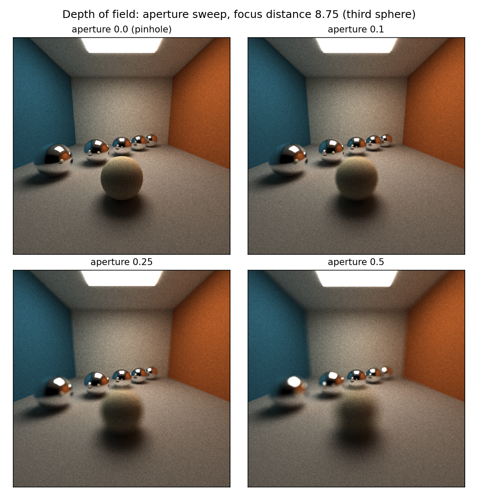

*Aperture sweep at a fixed focus distance of 8.75, the third mirror sphere. 400x400,
1500 samples: with the aperture closed (top left) every sphere is equally sharp;
opening it blurs the near diffuse ball and the first two mirrors while the sphere
at the focus distance stays crisp. The shadows under the balls blur with their
casters, which is the geometrically correct behaviour and the usual tell of a real
lens.*

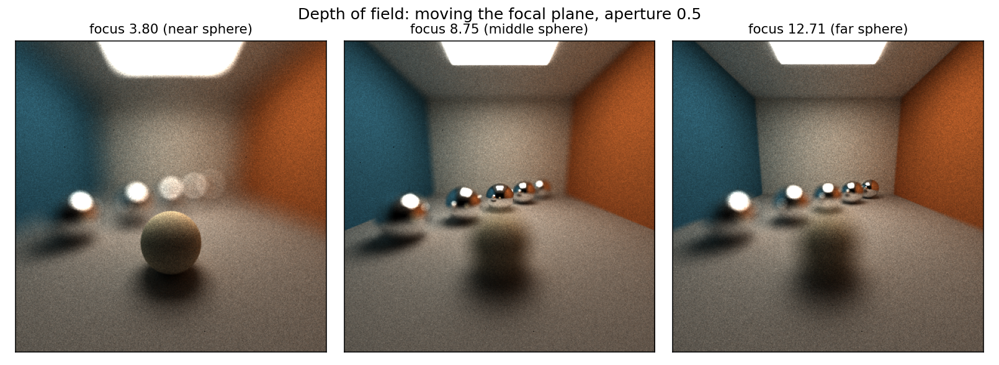

*The same scene at aperture 0.5 with the focal plane moved onto the near ball
(3.80), onto the third mirror (8.75) and onto the last mirror (12.71). The ball is
2.8 units across and its blur disk at 3.80 is `2 * 0.5 * |3.8 - 8.75| / 3.8` = 1.30
units, almost half its diameter - which is why the ball is sharp while the room
behind it dissolves in the left panel, and why every mirror except the last one is
blurred in the right one.*

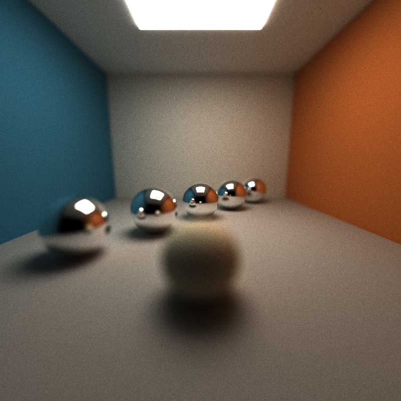

*`scenes/dof.json` at 800x800, 2000 samples, aperture 0.25: the focus plane sits on
the third of the five mirrors running away from the camera.*

**A camera bug this feature uncovered.** Writing the scene for this feature turned
up a bug in the base code's interactive camera. `main()` recovers the orbit camera
parameters (azimuth, elevation, distance) from the scene's `EYE`/`LOOKAT` pair,
and `runCuda()` rebuilds the eye position and the basis from them, so the two have
to be exact inverses. The recovery used `acos(normalize((0, view.y, view.z)) . (0,
1, 0))`, which is the *mirror* of the elevation rather than the elevation: any
scene that looks downwards (including the supplied `scenes/showcase.json`) had its
pitch flipped and its eye mirrored below the look-at point - the DOF scene put the
camera under the floor, looking up, and rendered black. The elevation is now
recovered as `acos(-forward.y)` with `forward` the unit eye-to-look-at vector, and
the camera basis is normalised (`cross(view, up)` was used unnormalised, which
squeezed the horizontal field of view of every tilted camera). Both changes are
exact no-ops for a level camera: the Cornell images in this README are
bit-identical before and after the fix, and the cover image was re-rendered
because `scenes/showcase.json` intentionally looks down.

### Procedural shapes

Two of the objects the scene format understands are not primitives but procedural
shapes, defined as signed distance fields and intersected by sphere tracing: a
power-8 **Mandelbulb** and a level-3 **Menger sponge**, both added as new
`GeomType`s (`scenes/procedural.json` asks for them with `"TYPE": "Mandelbulb"` /
`"TYPE": "Menger"`).

Sphere tracing works because a signed distance field *lower bounds* the distance
to the surface, so a step of that size can never tunnel through it. One property
of the base code forces a correction here: the shape is evaluated in object space
(where its field has Lipschitz constant 1) but marched in world space, and scaling
the field by the object's largest scale factor turns it into a Lipschitz-s field -
so every step has to be divided by that scale, otherwise a scaled-up fractal is
stepped straight through.

```cpp
for (int i = 0; i < MAX_STEPS; i++) {
    glm::vec3 pWorld = rayOrigin + t * rayDirection;
    float d = sdfEvaluate(geom.type, multiplyMV(geom.inverseTransform, vec4(pWorld, 1)));
    if (glm::abs(d) < HIT_EPSILON) { hit = true; break; }
    t += glm::max(d * stepScale, HIT_EPSILON);   // stepScale = 1 / max scale
}
```

* The surface normal comes from the gradient of the field, taken as four
  evaluations arranged as the corners of a tetrahedron instead of the six a
  per-axis central difference would need.
* `MAX_STEPS = 128` and `HIT_EPSILON = 1e-4` bound the cost of a single test. A
  ray that grazes the shape can spend all 128 steps and still report "no hit"
  (see the histogram below) - the classic failure mode of sphere tracing, and the
  reason the shapes are used as *scene decoration* rather than, say, as a
  navmesh.
* Before marching, the ray is tested against the shape's bounding sphere (radius
  1.3 for the Mandelbulb, `sqrt(3)` for the Menger sponge, scaled by the object).
  That is a pure rejection test - the march itself still starts at `t = 0` - so
  `SDF_BOUNDING_SPHERE` can be flipped in `intersections.h` to measure the culling
  without changing a single pixel of the image.

Both shapes are fractal *distance estimates* rather than exact fields: the
Mandelbulb's `0.5 log(r) r / dr` bound is a lower bound with a well known
overestimate in the outer shell, which is why the marching needs the epsilon
rather than an equality test, and why the surfaces are slightly "soft" compared to
the analytic primitives.

### Procedural textures

Two procedural textures modulate the diffuse albedo: a 3D **checker board** and a
**marble** pattern built from fractal value noise. Both are pure functions of the
hit point - but of the hit point in *object space*, so the pattern is attached to
the object, follows its transform, and needs no UV layout at all. That last part
is what makes them usable on the SDF shapes above: there is no sane way to put a
(u, v) parameterisation on a Mandelbulb, but "the point I hit, in the object's own
coordinates" always exists.

```cpp
// checker: the parity of the lattice cell
float cells = glm::floor(p.x) + glm::floor(p.y) + glm::floor(p.z);
return glm::mix(vec3(1.0f), vec3(0.08f, 0.08f, 0.10f), glm::mod(cells, 2.0f));

// marble: veins along a diagonal, wrung by 5 octaves of value noise
float bands = sinf((p.x + 0.6f * p.y + 0.35f * p.z) * 3.0f + fractalNoise(p) * 6.0f);
return glm::mix(vec3(0.34f), vec3(1.0f), bands * bands);
```

The value noise is trilinear interpolation of an integer hash (`xorshift`-style
multiplies), and the fractal sum reuses it at five frequencies. The scene format
gained two optional material fields, `TEXTURE` (`none` / `checker` / `marble`) and
`TEXSCALE` (how many pattern cells fit into one object space unit).

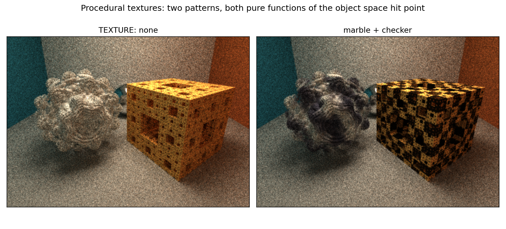

*The same scene and the same camera, with both textures switched off and on.
`scenes/procedural.json`, 400x400, 500 samples, cropped to the two shapes.*

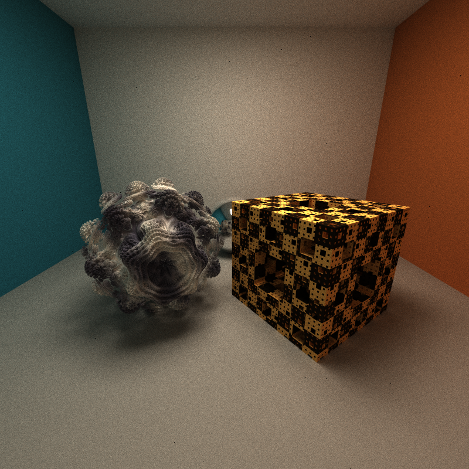

*`scenes/procedural.json` at 800x800, 3000 samples (14m32s): the marble
Mandelbulb on the left, the checkered Menger sponge on the right, a mirror ball
behind them. The grain that is left is Monte Carlo noise from the indirect
bounces - the sphere tracing itself is deterministic.*

## Performance Analysis

All numbers below: RTX 3060 Laptop, Release build, CUDA 13.3, MSVC 19.51, 800x800
with `DEPTH 8`, interleaved runs of the two binaries, median reported.

### Where the work goes: rays remaining per bounce

The path tracer prints how many paths it still processes after every bounce. The
shapes of those curves are the whole story of stream compaction:

| scene | b1 | b2 | b3 | b4 | b5 | b6 | b7 | b8 | b9 |
|---|---|---|---|---|---|---|---|---|---|
| Cornell box (open) + compaction | 81.7% | 56.6% | 43.5% | 34.7% | 28.0% | 22.9% | 18.7% | 15.3% | 0% |
| closed box + compaction | 99.5% | 97.9% | 96.3% | 94.6% | 93.0% | 91.4% | 89.9% | 88.3% | 0% |
| either scene, compaction off | 100% | 100% | 100% | 100% | 100% | 100% | 100% | 100% | 100% |

In the Cornell box 18% of the rays leave through the open front after the very
first bounce and only 15% survive to the eighth; in a closed box almost nothing
terminates early, which is exactly the case where compaction has nothing to
reclaim.

### Render time: open vs closed scene

| scene | compaction off | compaction on | result |
|---|---:|---:|---|
| Cornell box (open), 500 spp | 24.52 s | **16.15 s** | **1.52x faster** |
| closed box, 500 spp | 34.17 s | 37.27 s | 0.92x (9% slower) |
| closed box, 2000 spp | 133.8 s | 144.5 - 157.0 s | no benefit |

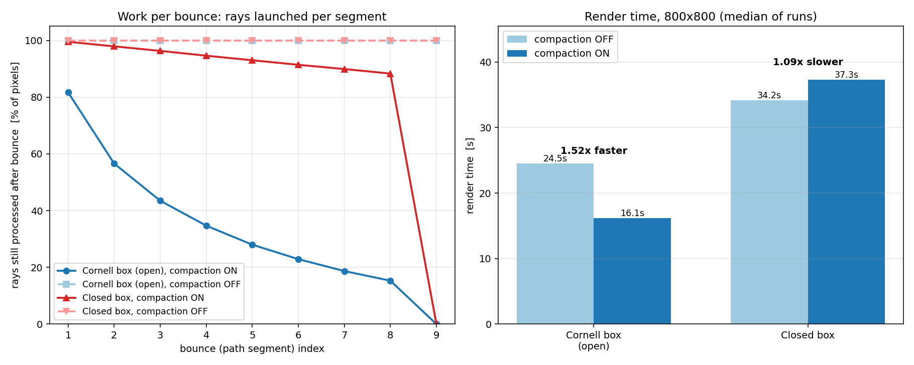

*Left: rays launched per bounce. Right: render time.*

This matches the instruction's hint that stream compaction only affects rays which
terminate. In the open Cornell box it removes 85% of the work over eight bounces
and pays for itself with a 1.5x speedup; in a closed box it removes ~12% of the
work while still paying for a padded scan (up to 2^20 elements), two scatters of
both mirrored arrays and one synchronization per bounce, so it ends up slightly
behind. Reducing that fixed cost - for example by scanning only the current ray
count instead of a padded power of two, or by keeping the compacted arrays in
shared memory for the small tail of a path - is the obvious next optimization.

### Anti-aliasing: cost and quality

Coverage jitter costs two random numbers per camera ray per iteration - it
measured 13.7 s vs 13.0 s at 400x400/1000 spp, i.e. within noise.

The quality is easier to measure on a hard edge with no Monte Carlo noise
(`scenes/sphere.json`: an emissive sphere against a black background), comparing
against a converged 400x400/4000 spp reference:

| version | whole image RMSE | silhouette band RMSE | worst pixel in the band |
|---|---:|---:|---:|
| AA on, 500 spp | **0.24** | **13.66** | 34 |
| AA off, 500 spp | 6.31 | 138.38 | 234 |

The remaining error with AA on is the Monte Carlo noise of 500 jittered samples
and shrinks with more samples; the error with AA off is systematic aliasing that
never converges away. The zoomed silhouette (left: converged reference, middle: AA
off, right: AA on) shows the same thing:

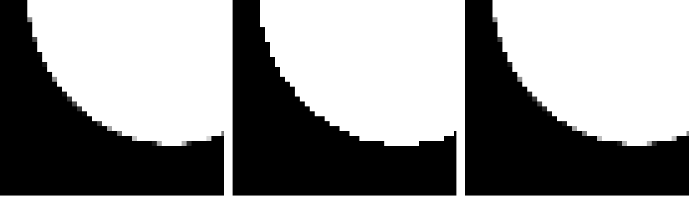

### Depth of field: cost

The thin lens model costs two extra random numbers, a square root and a
sine/cosine pair - but only on the **camera** ray, never on the interior bounces
that dominate a render. Interleaved runs of the same scene (800x800, 300 spp, three
runs each, medians):

| aperture | median render time | vs pinhole |
|---|---:|---:|
| 0.0 (pinhole) | 18.97 s | - |
| 0.5 | 19.49 s | +2.7% |

Individual runs were 18.75 / 19.72 / 18.97 s and 19.49 / 19.26 / 19.91 s, so the
2.7% is at the edge of run-to-run spread - the honest reading is "under 3%, of the
same order as the two extra RNG draws it actually adds".

On a hypothetical CPU version of this renderer the two extra lines would cost the
same per ray, and the feature would look just as cheap in a profiler - but it would
be paid *serially*, once per ray, on every one of the millions of camera rays.
What makes it free here is that the work is per-ray and has no cross-ray
communication: no extra memory traffic (the lens offset is two registers), no
divergence (the `aperture > 0` branch is uniform across the grid, and the rest is
straight-line arithmetic), and the camera kernel is a tiny fraction of the frame
time next to 8 bounces of intersection and shading. Depth of field therefore scales
with the number of pixels, not with the depth of the paths, which is the opposite
of every other feature in this project.

Two obvious next steps if it ever showed up in a profile: sample the disk from a
precomputed low-discrepancy table (a concentric or Sobol disk) instead of
`sqrt`/`cos`/`sin` per ray, and fold the four camera-ray random numbers (two for
anti-aliasing, two for the lens) into one stratified 4D sample so that the pixel
area *and* the lens disk are jointly stratified instead of independently jittered.

### Procedural shapes: cost, culling and divergence

Sphere tracing is by far the most expensive thing in this project. The table below
is `scenes/procedural.json` (the two fractals, the marble and the checker) against
`scenes/procedural_analytic.json`, which is the *same scene* with a sphere and a
cube in place of the two fractals, sized to the same bounding sphere / box. Same
camera, same samples per pixel, medians of interleaved runs at 400x400 / 300 spp:

| scene | render time | vs analytic |
|---|---:|---:|
| analytic primitives (sphere + cube) | 7.3 s | - |
| SDF shapes, bounding sphere on | 25.4 s | **3.5x** |
| SDF shapes, bounding sphere off | 31.1 s | 4.3x |

Two things fall out of that:

* **The shapes dominate the frame.** Every ray that tests a fractal pays 10-100
  field evaluations, where the analytic scene pays a quadratic solve. Sphere
  tracing buys an enormous amount of shape complexity for that price, but it is
  not free, and it is why the fractals sit in an otherwise simple room.
* **The bounding sphere culling is worth 1.22x**, and it is *free of side
  effects*: because the sphere is only used to reject rays and does not move the
  marching, enabling it leaves the image **bit-identical** (`max diff = 0` over
  the 400x400, 300 spp render). The same scene with the toggle off is 22% slower
  for no visual gain at all. Clipping the march to the sphere's entry point buys
  another ~13% on top, but that *does* change the sample positions - and a 1e-4
  change in the hit point is enough to decorrelate the noise of an 8-bounce path,
  so the two images differ pixel by pixel while agreeing in the mean to 0.03% of
  full scale. I kept the version that cannot be told apart from the baseline.

The tracer counts its own marching steps (the `[sdf]` lines on stdout, gated by
`SDF_STATS`), which is what the left panel below is made of. The counters are 64
bit, which matters more than it sounds: a 800x800/3000spp render produces 5.3e9
marches, and a 32 bit accumulator silently wraps that into a plausible looking
number.

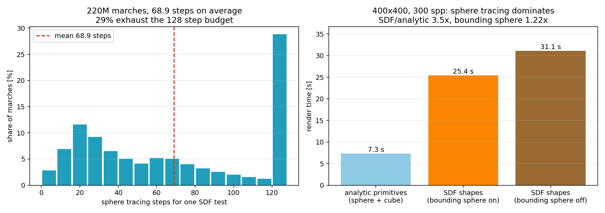

*220M marches at an average of 68.9 steps per SDF test, on the 400x400 / 500 spp
render. The last bucket is the interesting one: 29% of marches use the entire
128 step budget and give up. Those are the near-miss rays and the rays that pass
through the shell where the Mandelbulb's distance estimate is nearly zero.*

That 29% tail is also the most GPU-specific part of the feature. A warp marches
until every one of its 32 lanes is done, so lanes that finished in 20 steps sit
idle while a neighbour grinds to 128; the bar chart's average of 68.9 steps is
therefore a *lower* bound on what the hardware pays. On the CPU side the same
field evaluations would be spread over a handful of cores, and the divergence
would be hidden by out-of-order execution but paid with far lower throughput: a
RTX 3060 Laptop issues ~10^12 simple ops/s, so the ~10^10 field evaluations of
this 400x400 render take tens of seconds, where a CPU implementation of the same
fractal (for example the Embree based path tracer I wrote for my CG2025 course)
would need minutes for the same sample count. The feature *suffers* from the
divergence on the GPU, but it suffers much less than it would from the CPU's
throughput.

The textures are essentially free: switching both of them off changes the 400x400
render time by less than the ~5% run-to-run spread (25.4 s with, 25.2 s without;
on the analytic scene, 7.3 s with, 7.8 s without). That is not surprising once the
two costs are put side by side: the marble's 5 octaves of trilinear value noise
are ~100 ALU operations *per shading event*, while a single SDF test is ~69
marching steps of an 8-iteration Mandelbulb distance estimate, i.e. tens of
thousands of operations - and textures are evaluated once per bounce rather than
once per marching step. A file-backed texture with bilinear filtering and a bump
map would cost a little more (texture cache traffic, mip selection), but the
measurement here says the same thing the GPU literature does: procedural shading
arithmetic is cheap next to the geometry.

Ideas for further optimizing the shapes, in the order I would try them: march with
a *cone* against a hierarchical set of bounding spheres instead of a single one
(which prunes the tail properly rather than just the empty space), use the
distance estimate to skip the sphere tracing entirely for shadow rays (shadow rays
only need an occluded/not-occluded answer, so they can stop at the first small
step), lower the Mandelbulb's iteration count for screen pixels where the shape is
sub-pixel sized (a distance-based LOD), and precompute a small 3D texture of the
field so that most steps are a texture fetch instead of eight iterations of
trigonometry.

### Restartable rendering

A high quality render here runs for minutes (the cover is 3m55s, the procedural
scene 14m32s) and a film quality one would run for hours, which is a long time to
keep a laptop on. Restartable rendering makes that interruptible: the renderer
writes its state to `<FILE>.ckpt` while it runs, and the next start of the same
scene picks the samples up where they stopped.

**What has to be saved is almost nothing, and that is worth stating precisely.**
Everything else in the renderer is already stateless per iteration: the camera
rays, the path array, the intersection buffer and the compaction scratch space are
all rebuilt from the scene at the top of every iteration, and there is no
acceleration structure to serialise (the scene is a flat list of primitives that
`pathtraceInit` re-uploads). The durable state is exactly

* the accumulation buffer - one `glm::vec3` of un-normalised radiance per pixel,
* how many samples went into it,
* a fingerprint of the scene those samples belong to.

That is a 40 byte header plus `width * height * 12` bytes of payload - 7.3 MB at
800x800:

```cpp
struct CheckpointHeader {
    char magic[8];                 // "P3CKPT01"
    unsigned long long sceneHash;  // FNV-1a over camera, resolution, depth, materials, geoms
    int resolutionX, resolutionY;
    int traceDepth;
    int iterations;                // samples already accumulated
    int headerBytes, reserved;
};
```

The reason a resumed render is *the same* render and not a new one is the RNG
seeding: every sample draws with `(iteration, pixelIndex, depth)`, not with
whatever order the iterations happen in, so iteration 1209 gets exactly the same
random numbers whether it is the 1209th iteration of a fresh process or the first
one after a resume. The scene fingerprint is what keeps that honest: change the
camera, the resolution, the depth or any material in the scene file and the
checkpoint is rejected (`[checkpoint] ... belongs to a different scene, starting
from scratch`), because samples of a different image must not be averaged into
this one. Raising `ITERATIONS` *is* allowed, and is the intended way to extend a
render: the total target is not part of the fingerprint.

The behaviour is controlled by one optional scene field, `CHECKPOINT` (seconds,
default 30, `0` disables the feature):

* while rendering, a checkpoint is written every `CHECKPOINT` seconds;
* `S` and `Esc` write one, next to the PNG they already save;
* finishing a render deletes it - a finished render has nothing to resume;
* the file is written as `<FILE>.ckpt.tmp` and then renamed, so a process killed in
  the middle of a write can never replace a good checkpoint with a truncated one.

```
$ cis565_path_tracer scenes/cornell.json          # stop it whenever
[checkpoint] writing cornell.ckpt every 30.0 s; stop and re-run the same scene to continue where it stopped
[checkpoint] saved at 79 samples
[checkpoint] saved at 170 samples
^C
$ cis565_path_tracer scenes/cornell.json          # same scene file
[checkpoint] resumed cornell.ckpt at 1208 samples
...
Saved cornell.2026-09-20_20-33-43z.1458samp.png.
[checkpoint] resume cost: 0.62 ms to read + upload
```

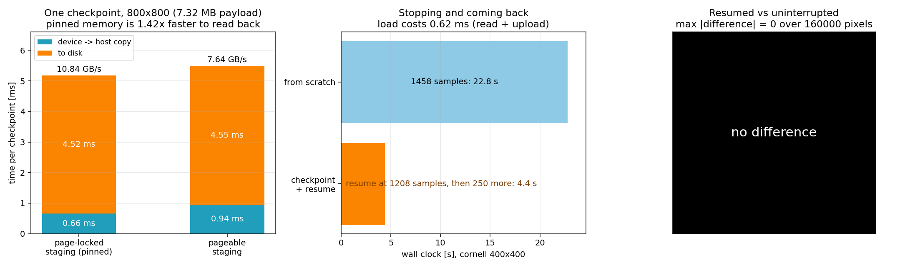

*Left: what one checkpoint costs at 800x800. Middle: stopping a 1458 sample render
at 1208 samples and finishing it later. Right: the difference between the resumed
image and the uninterrupted one - the whole point of the feature is that this
panel is empty.*

### Restartable rendering: cost

**Correctness first**: the resumed image is bit-identical to the uninterrupted
one. Interrupting a 400x400 render of `scenes/cornell.json` at 1208 samples,
restarting it and letting it run to 1458 samples gives `max |difference| = 0` over
all 160,000 pixels compared to a single 1458 sample render, and the two images
agree on their mean radiance to three decimals. A second run interrupted at 1141
samples and finished at 1291 also came out at exactly 0.

**What a checkpoint costs.** The accumulation buffer has to come back over PCIe,
which is the part a CPU renderer does not pay for at all, so it is the part worth
measuring (800x800, 7.32 MB payload, one save per second, timed by the tracer
itself around the copy and the write):

| staging buffer | device -> host | bandwidth | to disk | per checkpoint |
|---|---:|---:|---:|---:|
| page-locked (`cudaHostAlloc` + async copy on a stream) | **0.66 ms** | **10.84 GB/s** | 4.52 ms | 5.2 ms |
| pageable (`malloc` + blocking `cudaMemcpy`) | 0.94 ms | 7.64 GB/s | 4.55 ms | 5.5 ms |

Pinning the staging buffer is worth 1.42x: with pageable memory the driver has to
bounce the copy through a page-locked buffer of its own, which is exactly the copy
this avoids. The disk write dominates either way, and at the default 30 s interval
a checkpoint costs 5.2 ms / 30 s = **0.017%** of the wall clock; at the 1 s
interval used for the table it is still only 0.4%.

**A pass that comes with it.** The base code copied the whole accumulation buffer
back to the host *after every iteration*, because `saveImage()` reads it from
there - 7.32 MB per iteration at 800x800, on the default stream, so it serialised
with the kernels rather than overlapping them. With a known save and checkpoint
schedule that copy only has to happen when one of them is actually due, so
`pathtrace()` no longer does it and `saveImage()` and the checkpointer pull the
image down on demand. The same 7.32 MB transfer measures 0.94 ms through pageable
memory, so the copy the renderer used to do 500 times during a 500 sample render
cost **about 0.47 s, ~2.5% of a 19 s render** at this resolution. End to end that
is inside this machine's ±10-15% run to run spread, so the honest statement is
"removed a measured 0.47 s of transfer", not a wall clock difference - and it
means the numbers reported earlier in this README (stream compaction, depth of
field) were taken with that copy still in place, i.e. they are conservative.

On a hypothetical CPU renderer the same feature is a `memcpy` of a buffer that is
already in the process's own address space, so this is a case where the GPU
version *suffers*: the accumulation buffer lives in device memory and every
checkpoint costs a PCIe round trip that a CPU implementation simply does not have,
and the resume path uploads it back. What makes it cheap anyway is the ratio - 7.3
MB of I/O against 19 s of rendering, and 10.8 GB/s with pinned memory - so the tax
stays below the noise floor instead of becoming a design constraint, while the same
19 s of samples would take a CPU path tracer tens of minutes to produce.

Ways to take it further: overlap the copy with the next iteration by double
buffering (kick off the async copy into staging buffer A, render the next
iteration, write A to disk while the next copy fills B - the pieces exist, only the
ping-pong is missing); write the payload with `OVERLAPPED` file I/O so the 4.5 ms
disk write stops blocking the render loop; compress the payload (fp16 halves it,
but breaks the exact-resume property, so it belongs in a separate "approximate
resume" mode); and on a multi-GPU machine, checkpoint into pinned memory and hand
the buffer to a second device to continue there, which is the same mechanism as a
single-device resume.

### Russian roulette

The bounce loop has a hard budget (`DEPTH`), which is wasteful: a path that has
bounced off three white walls carries almost the same radiance as one that has
bounced off six, but both cost a full intersection and shading pass per bounce.
Russian roulette gives every path a *survival probability* after a few bounces and
divides the survivors' weight by it, which is exact in expectation:

$$
\mathbb{E}\left[\text{survive? } \frac{\text{throughput}}{p} : 0\right]
= p \cdot \frac{\text{throughput}}{p} = \text{throughput}
$$

```cpp
if (depth >= RR_MIN_DEPTH) {
    const float survival = glm::clamp(maxComponent(pathSegment.color), 0.05f, 1.0f);
    if (rrU01(rng) >= survival) {          // kill: loses nothing on average
        pathSegment.color = glm::vec3(0.0f);
        pathSegment.remainingBounces = -1; // <- the predicate stream compaction removes
        return;
    }
    pathSegment.color /= survival;         // survivors carry the weight of the dead
}
```

* It is the colour dependent version of the roulette the BSDF lobes already use
  (a lobe is picked with a probability and its weight divided by it); here the
  probability is the throughput instead of a lobe weight.
* `maxComponent(throughput)` is the standard choice (PBRT v4 13.7): a path that
  has lost 90% of its weight is 90% likely to die, one that is still bright
  almost always survives.
* The 0.05 floor keeps a path that has become very dim alive 5% of the time
  instead of killing it outright - a pure variance/throughput trade-off.
* Killed paths are marked with `remainingBounces = -1`, which is exactly the
  predicate the stream compaction from the first part of this README removes
  paths with, so the two features cooperate without extra plumbing: roulette
  decides *that* a path is worthless, compaction *stops launching threads* for it.
* `RUSSIAN_ROULETTE`, `RR_MIN_DEPTH` (3 segments, i.e. after two bounces) and
  `RR_MIN_SURVIVAL` (0.05) are `#define`s in `pathtrace.cu`, so the feature has a
  clean before/after switch.

The tracer counts its own roulette decisions (`[rr]` on stdout):

| scene | decisions per camera ray | killed | mean survival probability |
|---|---:|---:|---:|
| Cornell box, open, 8 bounces | 313.7 | 25.5% | 0.745 |
| closed box, 8 bounces | 1507.8 | 18.5% | 0.815 |
| closed box, 16 bounces | 2356.1 | 16.7% | 0.833 |
| glass box, 12 bounces | 2907.1 | **51.2%** | 0.488 |

The kill rate and the mean survival probability are two views of the same number
(they have to sum to 1), which is a useful self-check on the instrumentation - and
one that caught a bug in it: summing the survival probabilities into a single
`float` accumulator silently stops working once the total passes $$2^{24}$$,
because from there on an increment of ~0.7 is smaller than one ulp of the
accumulator. The counter is accumulated in fixed point (thousandths) now. The
glass row is the interesting one and is discussed under refraction below: a
refractive interface *compresses* the path weight, so roulette sees the inside of
glass as unimportant and kills half of what gets in there.

### Russian roulette: cost and bias

**Work** comes straight out of the per-bounce profile, so it has no timing noise
in it: summing the surviving paths over the bounces gives the number of path
segments a sample costs (800x800, 500 spp, `DEPTH` inside the labels):

| scene | segments/sample, RR off | RR on | work removed | wall clock off -> on | |
|---|---:|---:|---:|---:|---:|
| Cornell box, open, 8 bounces | 302 | 240 | 20% | 21.5 s -> 17.8 s | **1.21x** |
| closed box, 8 bounces | 751 | 540 | 28% | 41.9 s -> 30.0 s | **1.40x** |
| closed box, 16 bounces | 1406 | 686 | **51%** | 87.0 s -> 45.5 s | **1.91x** |
| glass box, 12 bounces | 1115 | 384 | **66%** | 24.8 s -> 12.8 s | **1.94x** |

That is the shape the instruction asks about: the tie is a laser. As the depth
budget grows, the fraction of the work that lives in the tail grows with it, and
roulette removes nearly all of the tail; the deeper you can afford to trace the
more roulette pays. It also means roulette is what makes a large `DEPTH` usable at
all - a 16 bounce render costs less with roulette on than an 8 bounce render
costs without it.

**Bias** is the part that has to be proven, not asserted. Same scene, same seed
structure, against a converged 5000 sample render of the open Cornell box that
predates this feature:

| measurement | RR off, 500 spp | RR on, 500 spp |
|---|---:|---:|
| mean image radiance, relative to the 5000 spp render | +0.013% | +0.013% |
| RMSE against the 5000 spp render | 6.73 | 7.13 |
| mean of (RR on - RR off) | -0.0003 (per channel 0.000) | |

The means agree to three decimals with each other *and* with the reference, i.e.
there is no detectable DC shift, while the per-pixel error grows by 6% - the
variance the roulette is expected to add. Cheaper and unbiased, which is the
whole point.

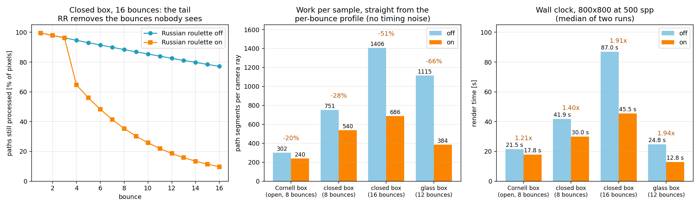

*Left: what roulette does to the tail (closed box, 16 bounces). Middle: work per
sample from the profile. Right: wall clock.*

The extra variance is not concentrated in the refraction: at the same sample count
the RR on/off glass renders differ by 6.9 gray levels inside the glass ball and
6.7 on the walls (signals of 92 and 110), i.e. roulette is not making the glass
specifically noisier.

**On the GPU** the payoff of killing a path is a little indirect: a thread whose
path died stops immediately, but its warp still runs until the slowest lane is
done, so the saving is realized through *stream compaction* - the killed paths
leave the arrays, and the next bounce launches proportionally fewer warps. On a
CPU path tracer the same kill is a `continue` in a loop over rays, with no
divergence penalty at all, so roulette's saving is if anything cleaner there; what
the GPU adds is that it can afford the deep budgets where roulette matters most.
Both are far better off than the alternative of raising `DEPTH` and paying for
every path.

Further: an adaptive floor (dark scenes can tolerate a much smaller clamp than
0.05), using roulette to replace the hard depth cap entirely so long as the
estimator stays unbiased, basing the decision on a *separate* weight that ignores
the refraction compression (see below), and path *splitting* in dark regions -
the mirror image of roulette, which reduces variance instead of increasing it.

### Refraction and Fresnel

A dielectric surface has exactly two outgoing delta directions, the mirror
direction and the refracted one. They are chosen with the Fresnel probability, so
the estimator stays unbiased for every angle and index of refraction:

```cpp
const float etaI = entering ? 1.0f : m.indexOfRefraction;
const float etaT = entering ? m.indexOfRefraction : 1.0f;
const float fresnel = fresnelDielectricSchlick(cosThetaI, etaI, etaT);

if (u01(rng) < fresnel) {                                   // reflect, prob F
    direction = glm::reflect(incident, n);
    weight    = m.color * (dielectricWeight / probability);
} else {                                                    // transmit, prob 1-F
    direction = glm::normalize(glm::refract(incident, n, etaI / etaT));
    weight    = m.color * radianceScale * (dielectricWeight / probability);
}
```

* The Fresnel term is Schlick's approximation with the cosine of the
  *transmitted* angle, `F = F0 + (1 - F0)(1 - cos(theta_t))^5`, which stays
  accurate for indices of refraction far from 1.5 (PBRT v3 8.2.3). When Snell's
  law has no solution the interface is in **total internal reflection** and `F`
  is 1, so the transmit branch is never taken and the bright rim a glass ball
  shows at grazing angles falls out of the maths rather than being special cased.
* `radianceScale` is `(etaI / etaT)^2`, the factor that makes the radiance of a
  path consistent when it enters a denser medium. It matters for paths that end
  *inside* the medium (depth budget or roulette) - see the roulette table above,
  where entering glass drops the path weight to 0.44 and therefore drops its
  survival probability with it.
* The base code's intersection tests already knew whether a ray started inside a
  primitive, but threw that away; `ShadeableIntersection` now carries an `outside`
  flag, which is what lets the BSDF swap `etaI`/`etaT` and reconstruct the
  geometric (outward) normal from the ray-oriented one the tests return.

A dielectric also exposed a bug in my own ray spawning: the hit point is nudged
along the normal to avoid self intersection, and the nudge has to follow the
*new* ray's side. A transmitted ray goes into the medium, so nudging it back out
along the incident side traps it inside the surface - which showed up as a
path tracer that suddenly could not render a mirror correctly, because every
bounce was re-hitting the surface it left. The nudge now uses the outward normal
oriented against the new direction, which is identical to the old behaviour for
reflection and diffuse bounces and correct for transmission.

`scenes/glass.json` puts a glass sphere (IOR 1.5), a water sphere (1.33) and a
mirror sphere in the same closed room, and the camera block runs at 12 bounces:

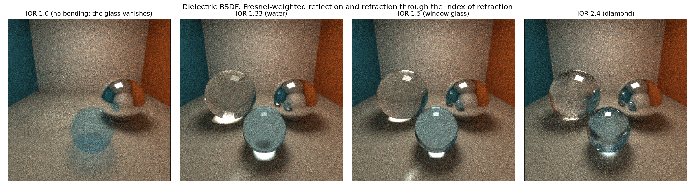

*The same scene with the index of refraction swept. IOR 1.0 is the unit test
worth staring at: `F0 = 0` and Snell's law is the identity, so the dielectric
becomes an invisible surface and the big sphere vanishes completely (the faint
blue ball in front is the water sphere, whose slightly blue material colour still
tints what it transmits). From there, rising IOR bends the image of the room
harder, brightens the Fresnel rim, and by 2.4 (diamond) the sphere is mostly a
mirror with a small, heavily distorted window into the room behind it.*

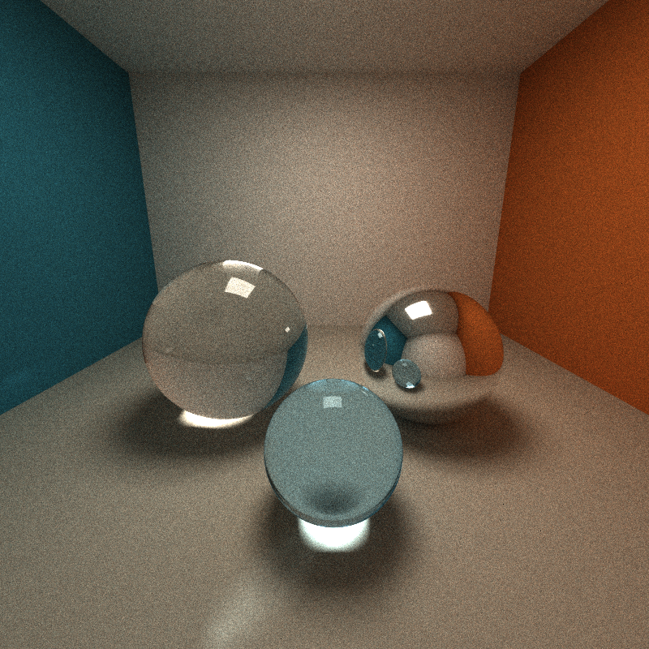

*`scenes/glass.json` at 800x800, 1600 samples: the glass ball refracts the teal
wall and the light into a bright focus on the floor, the water ball in front does
the same with a blue tint, and the mirror ball on the right reflects the room.*

Across the four indices of refraction the mean image radiance only moves from
105.1 to 102.0 gray levels (3%), which is the expected loss to the extra internal
Fresnel reflections and paths cut off by the depth budget - a missing or wrong
`(etaI/etaT)^2` factor shows up as a much larger shift when a path can end inside
the medium. The factor itself has a compile-time toggle
(`REFRACTION_RADIANCE_SCALING`) so that it can be flipped and measured.

**What refraction costs** is not the BSDF: replacing both dielectric spheres with
diffuse spheres of the same size (same scene, same camera, same sample count)
runs in 14.60 s against 14.34 s for the glass - within the noise of two runs each,
and if anything the glass is the cheaper one, because the same 3 random numbers
and one `glm::refract` replace the diffuse hemisphere sampling while the paths
that get trapped in the glass are killed by roulette. What glass does cost is
*bounces*: at 12 bounces the glass box needs 1115 path segments per sample with
roulette off, and roulette removes 66% of them (the largest reduction of any
scene here), so the two features fit together - glass wants depth, and roulette is
what makes depth affordable. On a hypothetical CPU renderer the same division of
labour holds; the GPU's version of "the paths diverge" is that a warp containing a
ray that entered the glass runs as long as that ray does, which is exactly the
case stream compaction and roulette exist to keep small.

The natural next step for the dielectric is a *rough* one - a microfacet
transmission model (GGX) instead of a perfect mirror/refract pair, which is the
last item of this section, plus tracking the nesting depth of the medium for two
payoffs: Beer-Lambert absorption for tinted glass, and skipping roulette while a
path is inside a refractive object so that the inside of glass is not rouletted
so aggressively.

### GGX microfacet specular

`ROUGHNESS` was parsed from the scene files from the start but never used: every
`Specular` material was a perfect mirror. It now selects a **GGX
(Trowbridge-Reitz) microfacet lobe**, with `alpha = roughness^2` (the Disney/PBRT
mapping, so that the middle of the slider looks like a surface in the middle of
glossy and matte) and the height correlated Smith masking-shadowing function:

$$
f(\omega_o,\omega_i) = \frac{F(\omega_o\cdot h)\, D(h)\, G_2(\omega_o,\omega_i)}
{4\,(\omega_o\cdot n)(\omega_i\cdot n)}
$$

Two things have to line up for the lobe to be *sampled* correctly, and they are
the actual content of "importance sampling" here:

* **Sample the distribution of visible normals, not the NDF** (Heitz 2018). With
  a half vector `h` drawn from the visible normal distribution the pdf of the
  reflected direction is

$$
p(\omega_i) = \frac{D_{\text{vis}}(\omega_o,h)}{4(\omega_o\cdot h)}
= \frac{G_1(\omega_o)\,D(h)}{4(\omega_o\cdot n)}
$$

  which collapses the estimator to `BRDF * cos / pdf = F * G2 / G1(wo)` - the
  normal distribution `D` cancels completely, which is why the code computes it
  but never needs it in the result. The plain NDF formula samples half vectors
  that point below the surface at grazing angles and throws those samples away.

```cpp
const float alpha = ggxAlphaFromRoughness(roughness);
const glm::vec3 wo = -incident;                       // toward the viewer
const float NdotV = glm::max(glm::dot(normal, wo), 1e-4f);
const glm::vec3 h  = ggxSampleVisibleNormal(normal, wo, alpha, u01(rng), u01(rng));
const glm::vec3 wi = glm::reflect(incident, h);
// ...
const float D   = ggxDistribution(NdotH, alpha);
const float G2  = ggxG2HeightCorrelated(NdotV, NdotL, alpha);
const float G1o = ggxG1(NdotV, alpha);
const float pdf = G1o * D / (4.0f * NdotV);           // = D_vis / (4 wo.h)
weight = F * (D * G2 / (4.0f * NdotV * NdotL)) * (NdotL / pdf);
```

* The **height correlated** Smith `G2` (Heitz 2014) rather than the separable
  product `G1(wo)G1(wi)`: the separable form darkens rough surfaces at grazing
  angles, which makes rough metal look like rough metal that has been dipped in
  soot. With the correlated form the `G2/G1` ratio in the weight is still the
  correct one because the same `G2` sits in the BRDF.

`scenes/glossy.json` is a row of five copper spheres stepping through
`ROUGHNESS` 0.0, 0.08, 0.2, 0.4, 0.7, with a gold sphere and a glass sphere in
front:

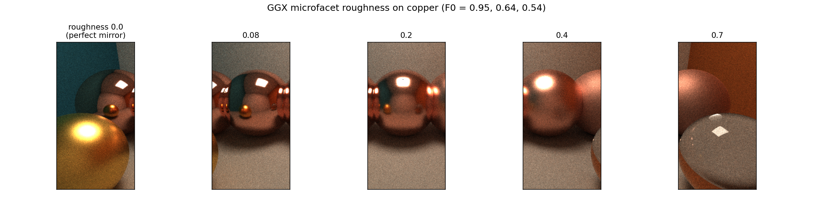

*The same five spheres, cropped: from a mirror that reflects the room to a
surface that has lost the reflection but kept the metal's colour. Note that only
the highlight's **shape** changes with roughness - the reflected radiance is
still the room, which is what makes this lobe energy conserving.*

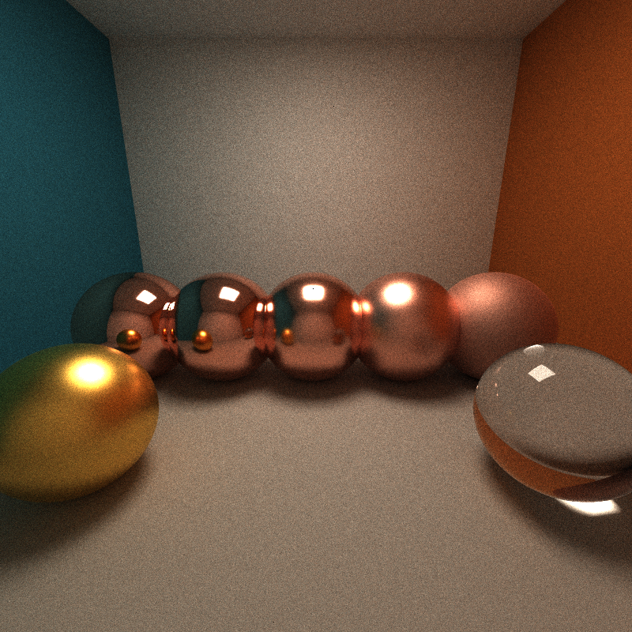

*`scenes/glossy.json` at 800x800, 2000 samples (2m24s).*

**Sampling strategy.** `GLOSSY_VNDF_SAMPLING` switches between the visible normal
distribution and the classic NDF formula, so the claim can be tested rather than
believed. On this scene the two are statistically indistinguishable: mean image
radiance 92.67 against 92.60 (0.08%), and the difference image is noise
(RMS 10 gray levels at 800 samples). That is the honest result, and it has a
specific reason - the sphere row is lit from above and seen from roughly its
equator, so the grazing angles where the NDF formula starts wasting samples cover
a thin band of pixels. The failure it prevents is real but geometric: aim a
camera along a rough surface (a floor seen at the horizon) and the NDF sampler
spends its samples on half vectors below the surface, which either biases the
image dark (if they are dropped) or produces fireflies (if they are kept with a
clamped pdf). Importance sampling the *visible* normals is the version that is
correct by construction, so that is what the default build uses.

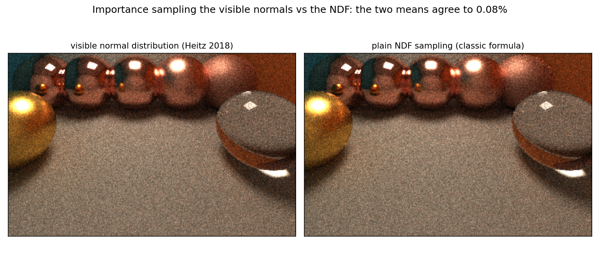

**Cost.** The lobe itself is free. The same scene with all five roughness values
set to 0 (a pure mirror) renders in 12.1 s against 12.2 s for the GGX version
(400x400, 600 spp, 2 runs each) - two extra random numbers, a square root and a
handful of dot products, next to an intersection test that walks a linear list of
primitives. What roughness *does* change is the **rays**: a rough surface spreads
the outgoing directions, so neighbouring pixels no longer share a narrow bundle
and the intersection loop's memory access becomes less coherent. That is a
GPU specific cost (a CPU renderer with the same code sees the same statistics but
no warp); it is also exactly why the importance sampling is worth having, since
the alternative to a well sampled lobe is more samples.

Further: the single scattering Smith model loses energy at high roughness (light
that should bounce a second time inside the microsurface is simply lost), which is
usually fixed with the multiple-scattering compensation of Fdez-Aguero 2019 -
worth doing before this lobe is used at `roughness > 0.6` in a scene that has to
be radiometrically exact. The other obvious step is to stop choosing between the
diffuse and specular lobes with a coin flip and instead sample both and weight
them with multiple importance sampling, which is the next feature.

### Better random number sequences

Every sample in this renderer used to come from one hash seeded linear
congruential generator, which is a perfectly good generator and a wasteful way to
sample an integral: pure random points clump, and a clumped sample is a sample
whose information is partly wasted. The pixel area and the lens (the two
dimensions of the *camera* ray) are now sampled with a **scrambled Halton
sequence** (`src/sampling.h`):

$$
x_d(i) = \mathrm{fract}\left(\Phi_{b_d}(i) + r(p, d)\right)
$$

where $$\Phi_{b_d}$$ is the radical inverse in the d-th prime base, i is the
iteration and r is a Cranley-Patterson rotation hashed from the pixel and the
dimension. The rotation is what decorrelates neighbouring pixels: without it every
pixel would take the same pattern and the image would show structure instead of
noise. The prime bases are what decorrelate the *coordinates* of a sample.

Both of those are worth spelling out, because both were measured here rather than
assumed:

| attempt | what happened |
|---|---|
| base 2 for every dimension with an XOR of the index (the cheap "Sobol-like" shortcut) | each coordinate is stratified on its own but the **pair lies on a constant diagonal** - the sphere silhouette RMSE went to 11.8, six times *worse* than the random sampler it was supposed to beat |
| the same dimensions shared by every bounce of a path | every bounce draws the same values, the bounces correlate and the image **darkens by 2%** |
| same directions applied to the BSDF and the roulette as well | the 200 spp Cornell render got **three times worse** (RMSE 34.6 against 11.6) and visibly grainier |

The last row is the one that decided the scope of this feature, and it is a known
result rather than a bug: a Halton sequence is a low discrepancy *point set*, and
its quality lives in a fixed, low dimensional projection. A path integral is the
opposite - its effective dimension grows with every bounce, the number of
dimensions a sample uses depends on where the path goes (a diffuse bounce spends
three, a mirror one, a dielectric two), and the integrand is discontinuous at
every silhouette. Handing that integral a deterministic sequence means the
correlation between dimensions shows up as structure instead of averaging out,
which is exactly what the grain in that render was. The sequence is therefore used
where the integral is two (sometimes four) dimensional, smooth within the pixel
area, and identical in shape for every sample: the camera ray.

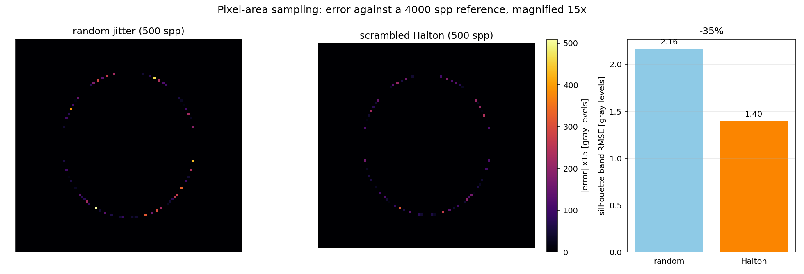

*Error against a 4000 spp reference, magnified 15x, for the emissive sphere of
`scenes/sphere.json`: random jitter on the left, scrambled Halton on the right.
The bright pixels around the silhouette - the samples that landed badly - are gone,
and the silhouette band RMSE drops from 2.16 to 1.40 gray levels (**-35%**); on the
whole image it drops from 0.240 to 0.155.*

The full path tracing scenes are deliberately **unchanged** by it, because their
noise is dominated by the path dimensions which still use the generator: on the
Cornell box at 200 spp the RMSE against the 5000 spp reference is 11.603 with
random jitter and 11.608 with the sequence, and the bias is -0.004 in both. That
is the honest summary of this feature: a 35% error reduction on the integral the
sequence fits, and nothing anywhere else.

**Cost**: the radical inverse is a short loop of integer divisions (the bases go up
to 311, so an index below 2^32 needs about five digits) plus one hash - four
draws per camera ray, per iteration. Measured 3.76 s against 3.70 s on the sphere
scene (+1.6%) and 6.9 s against 7.1 s on the Cornell box (inside the noise), i.e.
under 2% for a 35% error reduction on edges. `LOW_DISCREPANCY_SAMPLING` in
`sampling.h` turns it off for a direct comparison.

On a hypothetical CPU renderer the same arithmetic costs the same per sample and
the same argument applies; what a CPU packet tracer gains is that neighbouring
rays *could* share a coherent low-discrepancy block (one sequence per packet), an
idea that does not map onto a GPU where a warp's lanes belong to different pixels
and each needs its own scrambled sequence.

Further: an **Owen scrambled Sobol** sequence (proper digit-wise permutation
instead of a rotation) with a *padded* dimension budget - always consuming the
same dimensions per bounce regardless of which BSDF was hit - is the version that
would let the path dimensions use it too; that is the standard fix for exactly the
failure measured above. Correlated multi-jittered sampling (Kensler 2013) is the
stronger alternative for the pixel area specifically, since it also gives blue
noise like structure to the remaining error.

### Direct lighting: sampling the light instead of hoping to hit it

The renderer above only ever finds a light by accident: a diffuse bounce sprays a
ray into the hemisphere and feels lucky if it lands on the emitter. In the closed
Cornell box that is a 1 in 90 chance per sample, so the direct light - the part
of the image that is not a bounce - is carried by a handful of lucky paths and
shows up as the grain around the light. **Next event estimation** connects the
shading point straight to the light instead:

$$
L_d(p) = \frac{1}{N}\sum_{i=1}^{N} f(p, \omega_o, \omega_i)\, L_e\, \frac{\cos\theta_s \cos\theta_l}{d^2 \, \mathrm{pdf}_A(q_i)}
$$

The light is an axis aligned emissive box, so `pathtraceInit` distils every
emissive geometry into a `DeviceLight` (world bounds, emitted radiance, surface
area) and `sampleLightSurface` draws a point on the surface of a random light,
uniformly by area - a face is picked in proportion to its area, then a point on
that face (four random numbers, always, whatever happens next, so that a sample
uses a fixed dimension budget). The density is the union density,
$$1/(N\cdot A)$$: forgetting the `1/N` is invisible in every one light scene and
halves the direct light in a two light one, which is a bug this pass fixed.
`isOccluded` then traces the shadow ray with the same intersection routines the
tracer uses for its main rays.

The part that keeps this **unbiased without multiple importance sampling** is the
split: a diffuse vertex is handled by the estimator and stops counting the
emitters its own rays hit, while a delta vertex (mirror or dielectric) cannot be
connected to a light along the path and keeps counting them. The two sets are
disjoint, so nothing is counted twice and nothing is dropped.

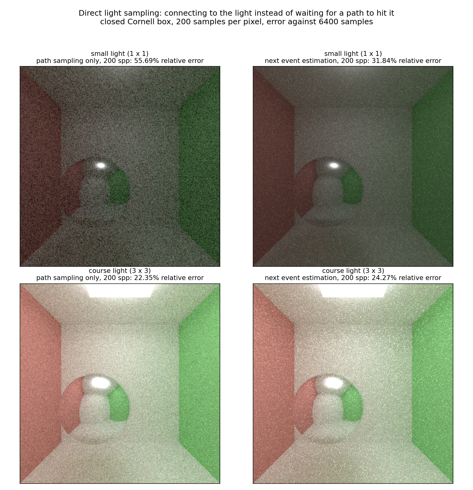

*Closed Cornell box, 200 samples per pixel, each panel labelled with its relative
error against its own 6400 spp render. With a light the size of a fist in the
ceiling (top row) the estimator replaces the grain with a smooth image; with the
course scene's 3 x 3 light (bottom row) it does not help, for the reason below.*

**How it was verified, and why that took more work than the estimator.** "Looks
less noisy" is not evidence of an unbiased estimator, and comparing against a
previous build is not either: clamping in `Image::savePNG` and a different random
stream both change the two images in ways that have nothing to do with the
integrator. So the renderer carries a **ledger** (`DIRECT_LIGHT_STATS`, printed as
`[lights]` lines at the end of a render) that counts, per light and per face of
each light, how many samples were drawn, how many were accepted and *why the rest
were thrown away* - and, the part that settles it, sums the energy the estimator
delivered against the energy of the BSDF emitter hits it replaced at those same
vertices. Both estimate the same integral at the same vertex, so the two totals
have to agree in expectation, and the ledger reports them with standard errors
computed from the sums of squares. Half of all samples land on a face pointing
away from the shading point (`behind the sampled face` below), which is not a
loss: those are exactly the samples the base renderer could never see either,
because a ray towards them would enter the box through a nearer face first.

| scene | samples | next event estimation | the BSDF hits it replaced | difference |
|---|---|---|---|---|
| plane under a light, 1 bounce | 200 | 2.97184e+5 | 2.98068e+5 | -0.30% +- 0.64% |
| open Cornell, 1 bounce | 400 | 8.60257e+6 | 8.64437e+6 | -0.48% +- 0.36% |
| Cornell, light below the ceiling | 400 | 1.83540e+7 | 1.83677e+7 | -0.07% +- 0.12% |
| open Cornell (the course scene) | 400 | 2.12428e+7 | 2.13594e+7 | -0.55% +- 0.27% |
| the same scene without the ceiling slab | 400 | 1.44616e+7 | 1.44664e+7 | -0.03% +- 0.09% |
| **open Cornell, the course scene** | 5000 | 1.06878e+9 | 1.06808e+9 | **+0.07% +- 0.09%** |

Everything is inside its error bar, including the two rows that disagree in sign:
at 400 samples the course scene read -0.55% and at 5000 samples the same scene
reads +0.07% +- 0.09%, so the 400 sample reading was the estimator's own heavy
tailed noise rather than a bias. That is worth spelling out, because it is the
trap this kind of measurement falls into: at 400 samples a few samples dominate
both the image and the sums of squares the error bar is computed from, so the
error bar is uncertain in exactly the case where the answer looks interesting.
The 400 spp deficit had looked scene specific - it sat entirely on the light's
*side* faces and vanished when the ceiling slab, which the scene's light box
intersects, was removed - which is why the two clean scenes were measured; they
put the estimator at 0.03% +- 0.09%.

Two things the ledger measured that I would not have guessed:

* **the light has to be skipped in its own shadow test.** Leaving it in costs
  8.5 points of acceptance and **35.8% of the energy**, because
  `boxIntersectionTest` reports its `t` in the geometry's object space and the
  light box is scaled 3 x 0.3 x 3, so comparing that `t` against a world space
  distance is meaningless. The samples that survive are the ones on faces the
  shading point can see, and for a convex light the segment to such a sample
  touches nothing but the sample itself, so there is nothing left to test.
  `LIGHT_SKIP_SELF_IN_SHADOW 0` reproduces the broken version.
* **the estimator was not the only thing that was wrong.** The ledger's
  non-finite counter fired a handful of times per render. Chasing it found a
  NaN that arrives from somewhere else entirely: `thrust::uniform_real_distribution`
  is documented as closed on both ends, so the BSDF's lobe selection could draw
  exactly 1, walk past the last lobe that has any weight and land in the
  dielectric branch of a pure mirror, whose weight is then `0 / 0`. The NaN
  throughput survived Russian roulette and every later bounce of that path, and
  since NaN does not survive the clamp in `Image::savePNG` the pixel went
  permanently black. That is fixed in `src/interactions.cu`.

**What it is worth**: for the light that this feature exists for, the 1 x 1 light
of `nee-small`, the relative error at 200 spp against a 6400 spp render drops
from **55.69% to 31.84%** (a factor 1.75, i.e. the same image quality as 612 spp
of the old estimator) and the per pixel noise from 0.0375 to 0.0224. It is not
free: 500 spp of that scene take **8.07 s without** and **11.36 s with** (41%
more, one shadow ray plus four random numbers per diffuse vertex; the ledger
adds another 7% on top, which is why it is a separate switch). Paying 1.41x for
1.75x is a 2.2x win.

**What it is not worth**: with the course scene's 3 x 3 light the relative error
actually gets slightly *worse*, 22.35% to 24.28%, and the per pixel noise from
0.0830 to 0.1047. A light that subtends a large solid angle is the case where
the BSDF already samples very well - and the estimator's own weaknesses show up:
half of its samples are spent on faces the shading point cannot see, and the
remaining half carry the `1/d^2 \cos\theta_l` variation of a large, close
emitter. That is the textbook motivation for multiple importance sampling, which
is the next feature and the reason this one is not a strict improvement in every
scene.

The same thing in wall clock terms, both on the closed Cornell box at 800 x 800,
500 samples: **24.1 s** with the estimator off, **35.5 s** with it on (+47%, one
shadow ray and four random numbers per diffuse vertex) and **38.5 s** with the
ledger as well (+8.5% on top of that, which is why the ledger is a switch).

Further: the wasteful half of the samples is the obvious thing to fix next.
Sampling only the faces the shading point can actually see - for an axis aligned
box, the face on the shading point's side of each axis - and dividing by the
visible area instead of the whole surface doubles the importance of every sample
that is kept, and for a constant integrand cuts the estimator's variance in half.
That, plus MIS against the BSDF samples the path still takes, is the version that
would also beat path sampling in the course scene.

The estimator has one more property worth having, from the refraction section:
without it, a path that transmits through glass can only reach a light if the
refracted ray happens to point at it, which makes the caustics under glass a
random walk problem. Connecting the *diffuse* vertex on the far side of the
glass fixes the light that comes through the glass in one step, while the
specular bounce that carries the caustic itself still cannot be connected (that
is what photon mapping or MIS exists for).

### Validation against the reference image

`img/REFERENCE_cornell.5000samp.png` ships with the base code and my render
reproduces its global illumination: the red and green walls bleed onto the floor
and the ceiling, the sphere casts a soft shadow and the ceiling light is the only
bright emitter.

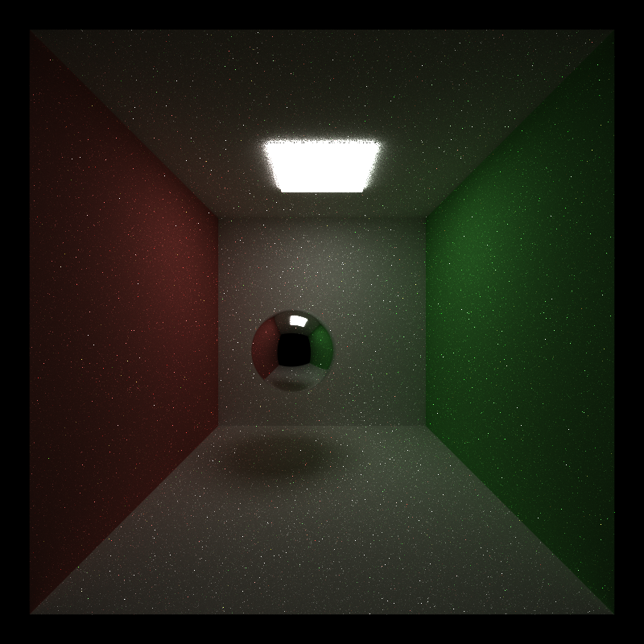

One deliberate difference: the scene marks its sphere as `Specular` with
`ROUGHNESS: 0.0`, which I read as a perfect mirror (the reference image's ball
looks like a much rougher, almost matte specular). A mirror sphere is what
`ROUGHNESS = 0` means in the GPU Gems 3, Ch. 20 sampling model whose `ROUGHNESS >
0` case is the "imperfect specular" extension, and the PR checklist lists perfect
specular as a core feature, so the sphere reflects the room instead.

## Scenes

| scene | what it is |
|---|---|
| `scenes/sphere.json` | single emissive sphere, used as the noise-free hard edge for the AA measurements |
| `scenes/cornell.json` | the supplied Cornell box (open towards the camera) |
| `scenes/cornell_closed.json` | the same box with a front wall and the camera moved inside, so no ray can escape - the closed case of the compaction analysis |
| `scenes/showcase.json` | the cover image: a closed room, a 5x5 ceiling light, three mirror spheres and a diffuse ball |
| `scenes/dof.json` | the depth of field scene: five mirrors receding from the camera, a near diffuse ball and `APERTURE` / `FOCUS` in the camera block |
| `scenes/procedural.json` | the procedural shapes: a marble Mandelbulb and a checkered Menger sponge in a closed room, plus a mirror ball |
| `scenes/procedural_analytic.json` | the same scene with a sphere and a cube sized to the fractals' bounds, for the "what does sphere tracing cost" comparison |
| `scenes/cornell_closed_deep.json` | the closed box with `DEPTH` 16, the scene where Russian roulette saves the most |
| `scenes/glass.json` | the dielectric scene: a glass sphere (IOR 1.5), a water sphere (1.33) and a mirror sphere in the closed room |
| `scenes/glossy.json` | the GGX roughness sweep: five copper spheres from a mirror to `ROUGHNESS` 0.7, plus a gold and a glass sphere |

No meshes or texture files are used - the textures are procedural, and the two
complex shapes are distance fields - so nothing has to be downloaded to render
any of them.

## CMakeLists.txt changes

The project needs three build fixes for CUDA 13 + MSVC (the same family of
problems as Project 2):

1. `include_directories("${CMAKE_CUDA_TOOLKIT_INCLUDE_DIRECTORIES}")` moved out of
   the `if(UNIX)` branch - `sceneStructs.h` pulls in `cuda_runtime.h` and is
   included by host (CXX) sources as well.
2. `-Xcompiler=/Zc:preprocessor` for CUDA: the CCCL headers shipped with CUDA 13
   refuse to build with MSVC's traditional preprocessor.
3. `/Zc:preprocessor` for CXX for the same reason, since the CUDA runtime headers
   are compiled as host code too.

Two `add_subdirectory(stream_compaction)` / `target_link_libraries(...)` lines were
uncommented to link my Project 2 implementation, and
`stream_compaction/CMakeLists.txt` got its source list filled in plus the same
`/Zc:preprocessor` option (and a stray `}` typo fixed in its
`set_target_properties` call).

## Third-party code and credits

* `stream_compaction/{common,efficient}.{h,cu}` is **my own Project 2 code**
  (cis5650_stream_compaction_test), copied in as the project instructions suggest;
  only the CUDA error helper was renamed to `scCheckCUDAError` so that it does not
  clash with `pathtrace.cu`.
* No libraries were added - no mesh or texture loader is used, and every scene is
  built from the cubes and spheres the base code already supports.
* References used for the shading: PBRT v4 sections 9.2 (diffuse reflection) and
  9.3 (specular reflection and transmission), GPU Gems 3, Ch. 20 for the specular
  sampling model, Paul Bourke's raytracing notes for anti-aliasing, and PBRT v4
  section 5.2.3 (the thin lens model) for the depth of field camera. The
  dielectric BSDF and the `(etaI/etaT)^2` radiance scaling follow PBRT v3 8.2.3,
  and the throughput based Russian roulette follows PBRT v4 13.7.
* The GGX lobe in `src/ggx.h` is written from the published formulas - the
  distribution and Smith masking from Walter et al. 2007 / PBRT v3 8.4, the height
  correlated masking from Heitz 2014, and visible normal sampling from Heitz,
  *Sampling the GGX Distribution of Visible Normals* (JCGT 2018). It is
  deliberately **not** ported from my CG2025 HW7 coursework: that project's
  `ggx_utils.hpp` came from a third party repository, which the course rules
  would require me to get approved and credit. The two are the same published
  algorithm, but this one is written here from the papers.
* The sampler follows Halton (1960) for the radical inverse and Cranley &
  Patterson (1976) for the rotation that decorrelates the pixels; the framing of
  "which integrals a low-discrepancy sequence actually helps" is from the
  [CSE 168 random sampling notes](https://cseweb.ucsd.edu/classes/sp17/cse168-a/CSE168_07_Random.pdf)
  linked from the project instructions.
* The procedural shapes follow the published distance estimators rather than any
  particular implementation: the power-8 Mandelbulb distance estimate from White
  and Nylander, *Mandelbulb: The Unravelling of the Real 3D Mandelbrot Fractal*
  (2009), and the Menger sponge folding from Inigo Quilez's distance function
  article ([iquilezles.org/articles/distfunctions](https://iquilezles.org/articles/distfunctions/)),
  which is also where the tetrahedron normal trick and the value noise used by the
  marble texture come from.
* The code in this project was written with the help of AI agents (pair
  programming over the CUDA/C++ sources, the build fixes and this README), in line
  with the course's third-party code policy.

