# CUDA Path Tracer

**University of Pennsylvania, CIS 5650: GPU Programming and Architecture,
Project 3 - CUDA Path Tracer**

* **Jing Huang**
  * [GitHub](https://github.com/Stabil1ze)
* Tested on: Windows 11, Intel i7-12700H @ 2.30GHz, 23GB,
  NVIDIA GeForce RTX 3060 Laptop GPU 6GB

> **Declaration of AI assistance.** In line with the course's policy on AI
> tools: the analysis text of this README and the benchmark and conversion
> scripts under `out/run/` and `out/asset-probe/` were drafted with the help of
> Codex. Every measurement is produced by code in this repository and can be
> reproduced by the commands and switches named next to it. The implementation,
> design decisions and readings of the results were reviewed and accepted by
> the author, who is responsible for their correctness. No third-party code was
> copied in without attribution in the credits section.

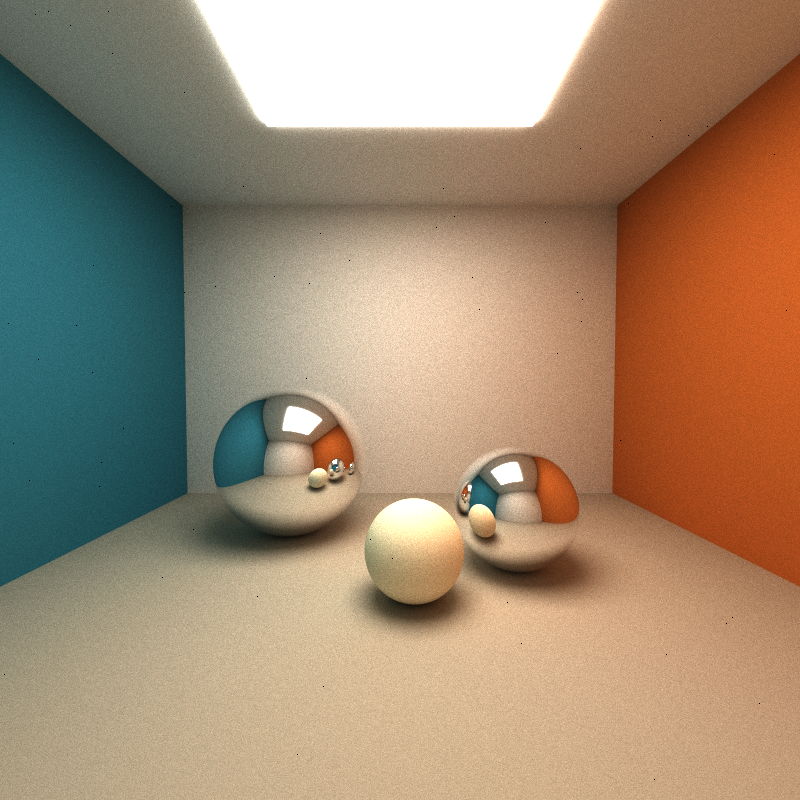

*`scenes/showcase.json`, 800x800, 3000 samples: a closed room lit by a 5x5
ceiling light with three mirror spheres and one diffuse ball.*

## Renders of third-party assets

Two scenes from the research community render here with no renderer changes at
all: the OBJ and PLY loaders read them and the SAH BVH accelerates them. The
models are large third-party data and are not committed; the converted scene
files and the conversion scripts live in the gitignored `out/asset-probe/`, and
the sources are listed in
[Third-Party Code and Credits](#third-party-code-and-credits).

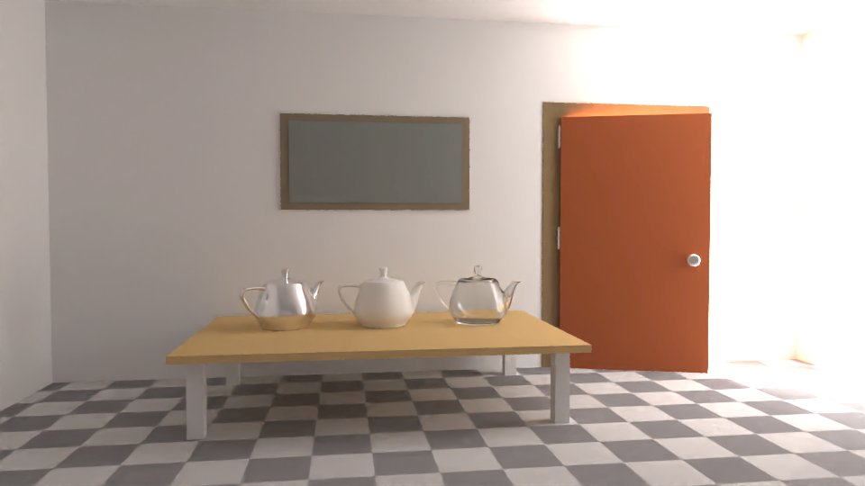

*`veach-ajar` by Benedikt Bitterli (CC0), from the pbrt-v4 scene pack: 22 objects
and 382,688 triangles, BVH built in 170 ms, 960x540 at 2500 samples and 12
bounces in 432 s. The scene's only light is a 1.5 x 2.6 m area light in the next
room, so this room is lit entirely through the open door; camera, materials and
lighting follow the pbrt scene description.*

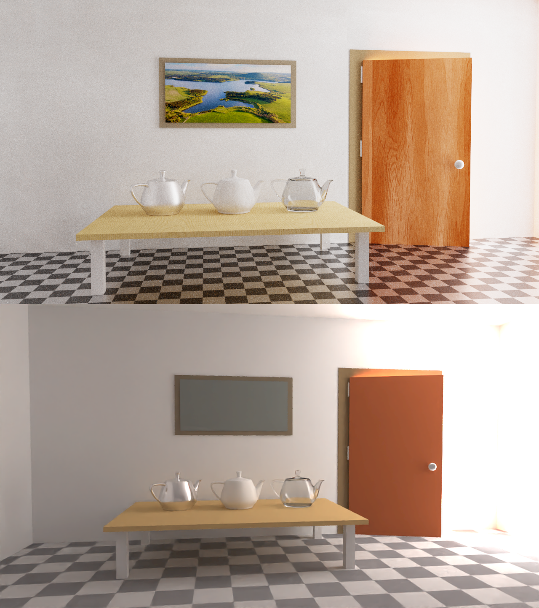

*The same view, the scene author's Tungsten reference above and this renderer
below: framing, the three teapots (metal, ceramic, glass), the door and the
checkered floor all agree. The picture, table and door are flat colours because
the renderer has no image textures yet, and the checker is the procedural
texture rather than the scene's own.*

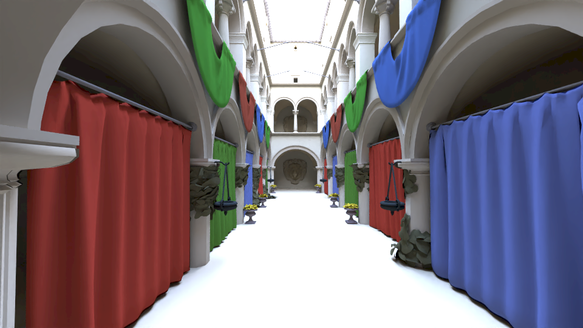

*Crytek Sponza by Frank Meinl, via Morgan McGuire's Computer Graphics Archive:
262,267 triangles, BVH built in 115 ms, 960x540 at 2000 samples and 6 bounces in
950 s. The model has no lights, so the atrium is lit by the sky dome through the
3.6 m opening that runs the length of the roof. Each of the 25 materials is one
flat colour (the average of its diffuse map), because image textures are not
implemented yet.*

## Overview

The CIS 5650 base code provides the framework: JSON scene loading, primitive
intersections, CUDA/OpenGL interop preview, and image saving. The renderer
extends it with a physically based BSDF, path scheduling, camera effects,
procedural geometry, an extended light system, mesh acceleration, and
denoising.

The main experimental switches are compile-time `#define`s:
`STOCHASTIC_AA`, `STREAM_COMPACTION`, and `SORT_BY_MATERIAL`. Depth of field
is scene-driven through `APERTURE` and `FOCUS`; it is off unless the scene asks
for it. Restartable rendering is controlled by `CHECKPOINT`; direct lighting,
MIS, Russian roulette, low-discrepancy camera sampling, SDF statistics, and
the light ledger each have their own switch.

### Feature and code map

| # | Effect | Code |
|---|---|---|
| 1 | BSDF shading kernel: ideal diffuse (cosine weighted) and perfect specular, dispatched per material | `src/interactions.cu`, `src/pathtrace.cu` |
| 2 | Material loading driven by `TYPE` / `ROUGHNESS` | `src/scene.cpp` |
| 3 | Stochastic sampled anti-aliasing: sub-pixel jitter, compile-time `STOCHASTIC_AA` | `src/pathtrace.cu` |
| 4 | Stream compaction of terminated paths: map / scan / scatter built on the Project 2 work-efficient scan | `src/pathtrace.cu`, `stream_compaction/` |
| 5 | Sorting paths by material: histogram / scan / scatter; implemented and measured, off by default | `src/pathtrace.cu` |
| 6 | Emitter hits accumulate directly into the image, allowing terminated paths to be removed | `src/pathtrace.cu` |
| 7 | Per-bounce ray counting and CUDA-event stage timings | `src/stats.h`, `src/stats.cu` |
| 8 | Physically based depth of field: thin lens camera with scene fields `APERTURE` / `FOCUS` | `src/pathtrace.cu`, `src/scene.cpp` |
| 9 | Camera basis and orbit-camera fixes | `src/scene.cpp`, `src/main.cpp` |
| 10 | Procedural shapes: power-8 Mandelbulb and Menger sponge | `src/intersections.cu` |
| 11 | Procedural textures: checker and marble in object space | `src/interactions.cu` |
| 12 | Restartable rendering: accumulation buffer and sample count saved to `<FILE>.ckpt` | `src/checkpoint.h`, `src/checkpoint.cu`, `src/main.cpp` |
| 13 | Russian roulette: kill paths with probability based on throughput, divide survivors by survival probability | `src/pathtrace.cu` |
| 14 | Refraction: smooth dielectric with Schlick Fresnel, total internal reflection, and radiance scaling | `src/interactions.cu`, `src/scene.cpp` |
| 15 | Glossy specular: GGX microfacet lobe with Smith masking-shadowing and visible-normal sampling | `src/ggx.h`, `src/interactions.cu` |
| 16 | Low-discrepancy sampling: scrambled Halton for the pixel area and lens | `src/sampling.h`, `src/pathtrace.cu` |
| 17 | Direct light sampling: next event estimation with shadow rays and a light ledger | `src/lights.h`, `src/pathtrace.cu` |
| 18 | Three-part material interface: `bsdfSample` / `bsdfEval` / `bsdfPdf` | `src/bsdf.h` |
| 19 | Multiple importance sampling using the power heuristic | `src/lights.h`, `src/pathtrace.cu` |
| 20 | Environment light: three-color sky dome for escaping rays | `src/lights.h`, `src/pathtrace.cu`, `src/scene.cpp` |
| 21 | Distant light: sun disc sampled by solid angle and combined with path hits | `src/lights.h`, `src/pathtrace.cu`, `src/scene.cpp` |
| 22 | Spherical area lights sampled by solid angle over their tangent cone | `src/lights.h`, `src/pathtrace.cu` |
| 23 | Mesh loading: OBJ and PLY parsers producing `TRIANGLE` geometry | `src/mesh.cpp`, `src/intersections.cu` |
| 24 | Bounding volume hierarchy: binned SAH CPU build and iterative GPU traversal | `src/bvh.cpp`, `src/bvh.h` |
| 25 | Denoising: Intel Open Image Denoise with normal and albedo guides | `src/denoise.cpp` |

## Feature Gallery

### BSDF shading kernel

The shading kernel dispatches to ideal diffuse or perfect specular lobes and
uses probability-weighted lobe selection to keep the estimator unbiased.
`shadeMaterials` handles ray escape, emitter hits, depth exhaustion, and
surface scattering; terminated paths are marked through `remainingBounces`.

**Files:** `src/interactions.cu`, `src/pathtrace.cu`

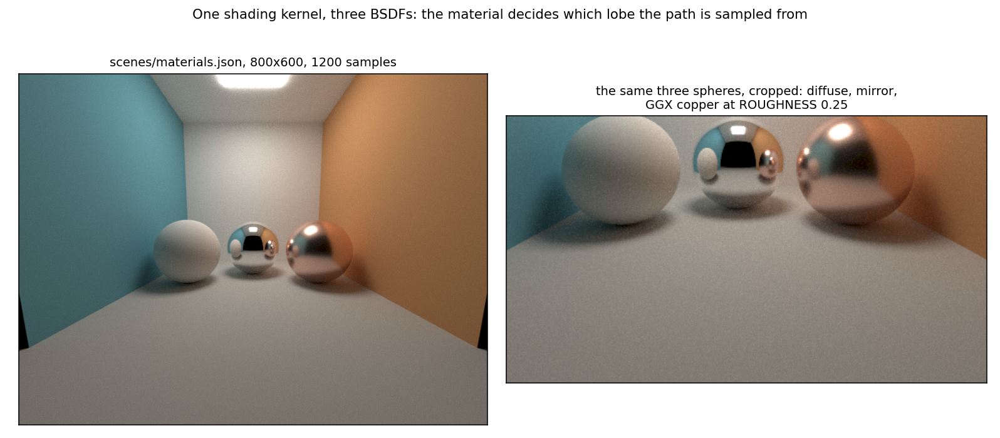

*`scenes/materials.json`: ideal diffuse, perfect mirror, and GGX copper at
`ROUGHNESS` 0.25.*

| Cornell box with diffuse sphere | Cornell box with specular sphere |
|---|---|
| 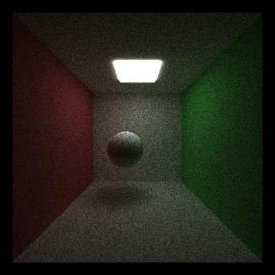 | 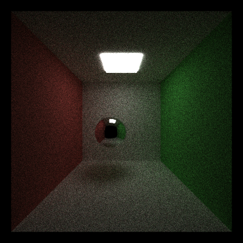 |

### Stochastic sampled anti-aliasing

Each camera ray samples a random point inside its pixel. The base code's
integer coordinate addresses the pixel corner, so the jitter covers
`[0, 1)`, and the camera ray uses its own RNG stream. The result removes
silhouette stair-stepping without changing the camera model.

**Files:** `src/pathtrace.cu` (`STOCHASTIC_AA`)


*Hard-edge comparison: converged reference, aliased render, and stochastic AA
render.*

### Path scheduling

**Stream compaction** removes terminated paths from the working arrays after
every bounce using map / scan / scatter. Emitter hits are accumulated into the
image immediately, so no final gather pass is needed. With compaction on the
image is bit-identical to compaction off.

**Material sorting** reorders paths by material id so a warp runs one BSDF
branch instead of several. The mechanism works, but its histogram, scan,
scatter, and loss of memory locality cost more than the branch uniformity
saves here, so it is off by default.

**Files:** `src/pathtrace.cu`, `stream_compaction/`

### Depth of field

A thin-lens camera samples the lens aperture and focuses rays at a focal
plane. Two optional scene fields extend the camera block:

| Field | Meaning | Default |
|---|---|---|
| `APERTURE` | Lens radius; `0` keeps the camera as a pinhole | `0` |
| `FOCUS` | Distance of the focal plane | Distance to `lookAt` |

**Files:** `src/pathtrace.cu`, `src/scene.cpp`, `src/main.cpp`

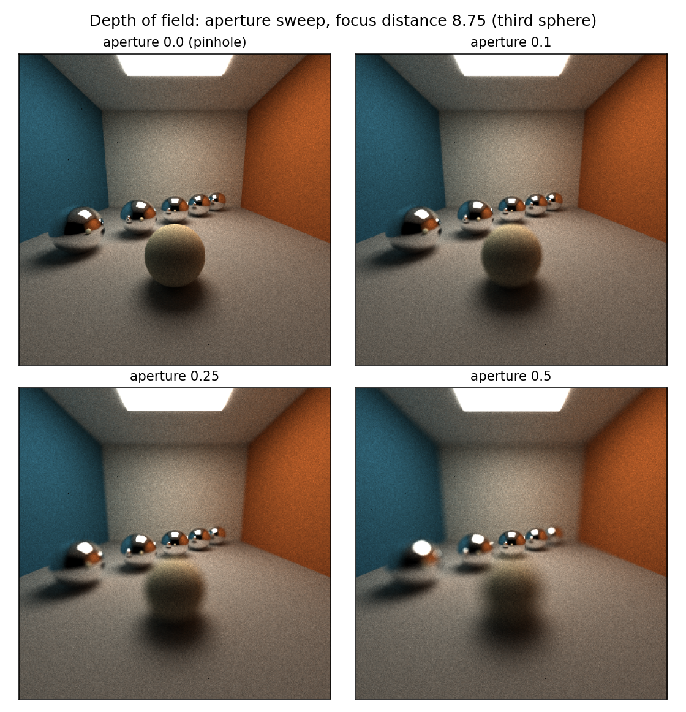

*Aperture sweep at a fixed focus distance.*

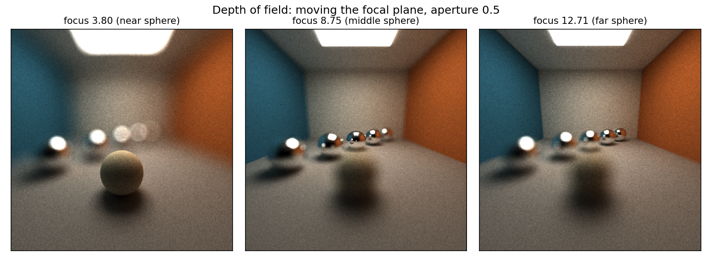

*The focal plane moved onto different spheres.*

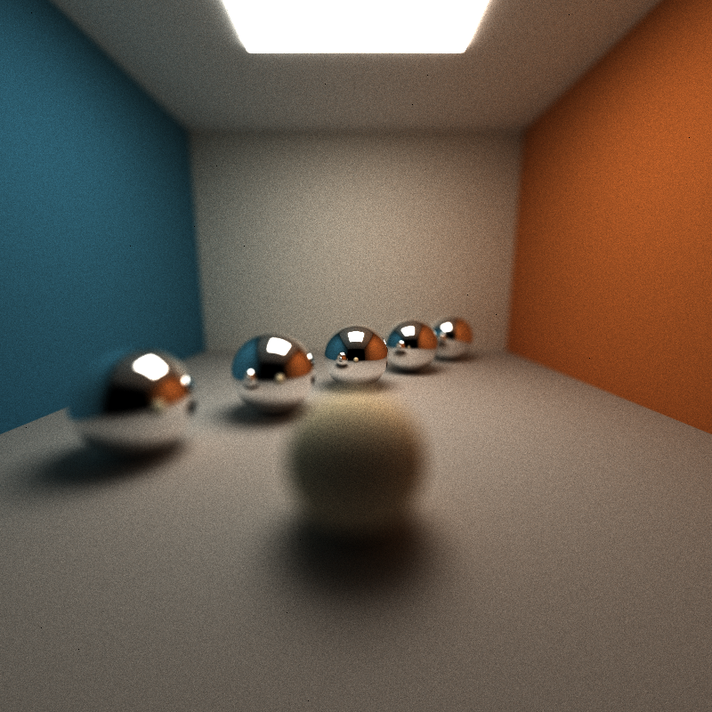

*`scenes/dof.json`, 800x800, 2000 samples, aperture 0.25.*

### Procedural shapes and textures

The scene format accepts two distance-field shapes: a power-8 Mandelbulb and a
level-3 Menger sponge. Both are intersected by sphere tracing with a bounding
sphere broad phase. Two procedural textures, checker and marble, evaluate on
the object-space hit point, so they need no UV layout and work on any shape.

**Files:** `src/intersections.cu`, `src/interactions.cu`, `src/scene.cpp`

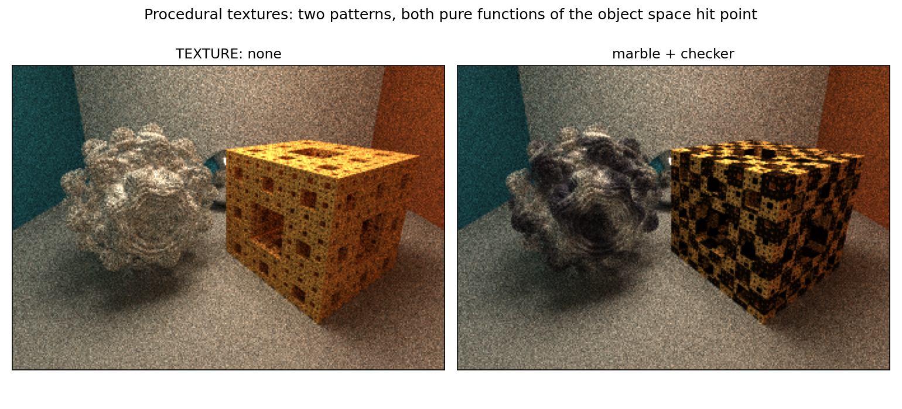

*The same scene with procedural textures off and on.*

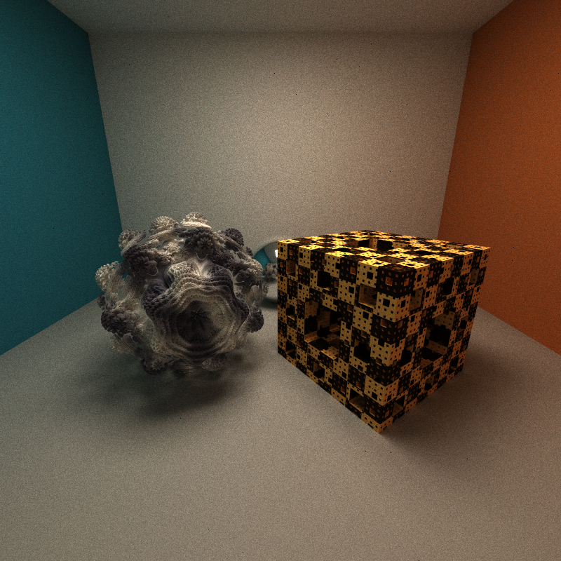

*`scenes/procedural.json`, 800x800, 3000 samples: marble Mandelbulb, checkered
Menger sponge, and a mirror ball.*

### Restartable rendering

The renderer checkpoints the accumulation buffer, sample count, and a scene
fingerprint to `<FILE>.ckpt`, then resumes the same sample sequence on the next
start. Resumed and uninterrupted renders are bit-identical.

**Files:** `src/checkpoint.h`, `src/checkpoint.cu`, `src/main.cpp`

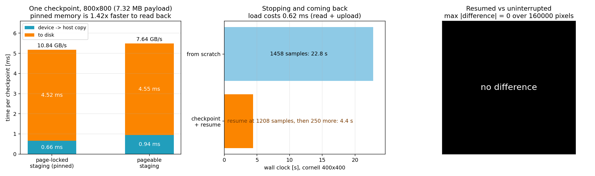

*Checkpoint cost, interruption/resume, and the difference between resumed and
uninterrupted output.*

### Refraction and Fresnel

Dielectric surfaces choose between reflection and refraction using Schlick
Fresnel, including total internal reflection and the radiance scaling of a
refractive interface.

**Files:** `src/interactions.cu`, `src/scene.cpp`

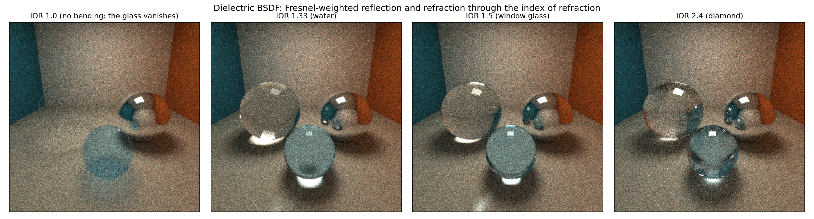

*Index-of-refraction sweep: from an invisible surface at IOR 1.0 to a
mostly mirror-like diamond at 2.4.*

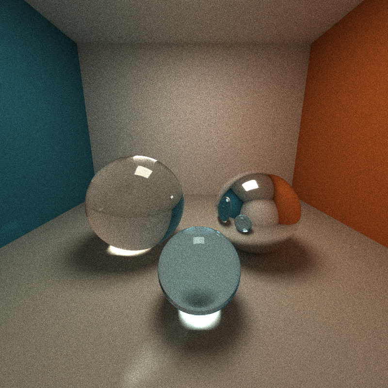

*`scenes/glass.json`, 800x800, 1600 samples: glass, water, and mirror spheres.*

### GGX microfacet specular

`ROUGHNESS` selects a GGX microfacet lobe with height-correlated Smith
masking-shadowing. The sampler draws from the distribution of visible normals
so that grazing-angle samples remain correct.

**Files:** `src/ggx.h`, `src/interactions.cu`

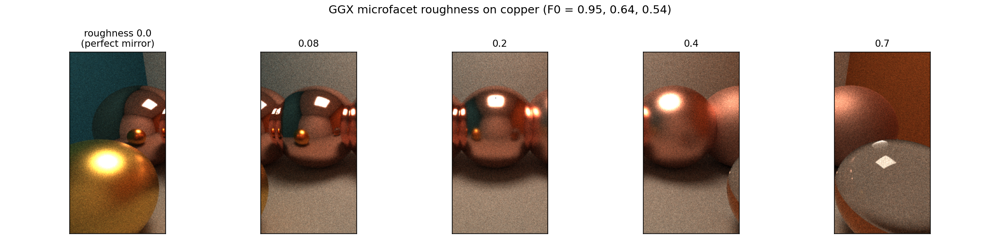

*Copper spheres from a perfect mirror to `ROUGHNESS` 0.7.*

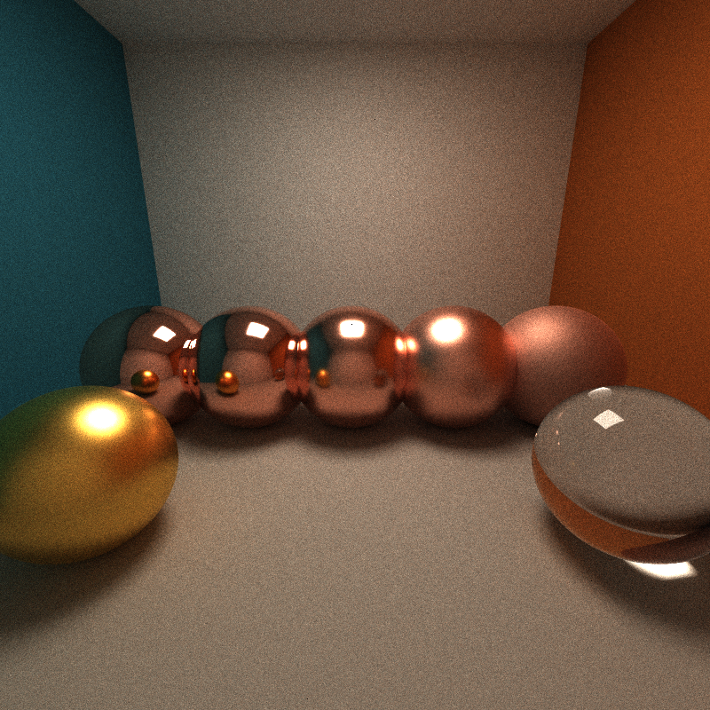

*`scenes/glossy.json`, 800x800, 2000 samples.*

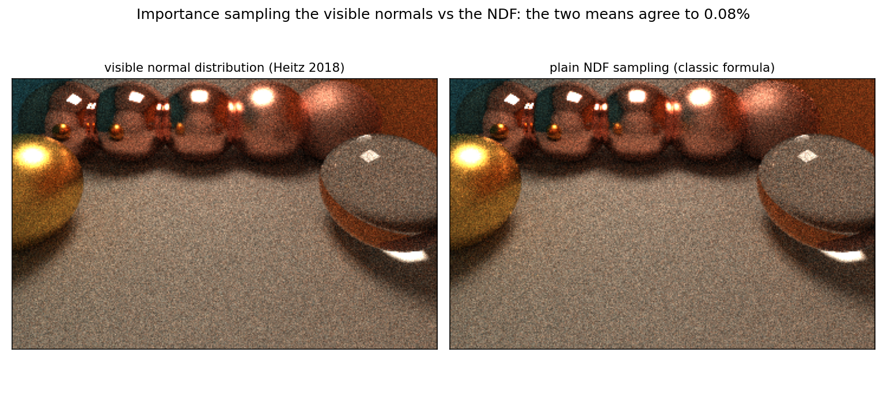

*Visible-normal sampling compared with the classic NDF sampler.*

### Low-discrepancy camera sampling

A scrambled Halton sequence samples the pixel area and the lens. It is kept
off the path dimensions because the effective dimension of a path integral
grows with every bounce.

**Files:** `src/sampling.h`, `src/pathtrace.cu`

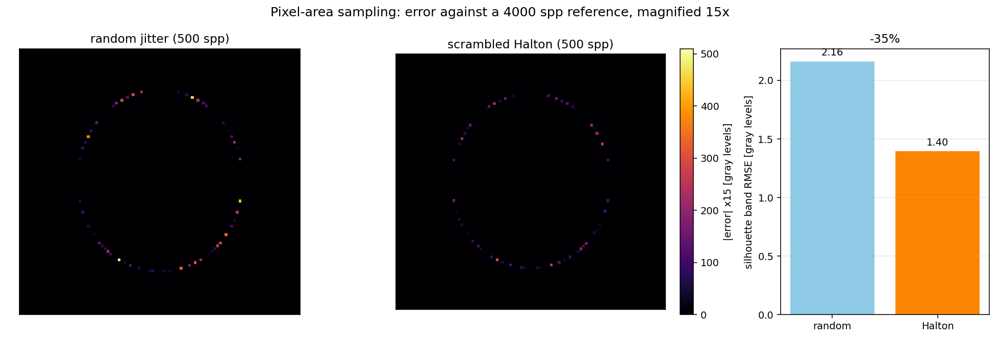

*Hard-edge error against a 4000 spp reference: random jitter on the left,
scrambled Halton on the right.*

### Direct lighting and multiple importance sampling

Next event estimation connects diffuse vertices directly to sampled light
points with a shadow ray. The light ledger tracks accepted samples and the
energy delivered by the estimator. A three-part BSDF interface supplies
`bsdfSample`, `bsdfEval`, and `bsdfPdf`; multiple importance sampling then
combines light sampling and BSDF sampling with the power heuristic.

**Files:** `src/lights.h`, `src/bsdf.h`, `src/pathtrace.cu`

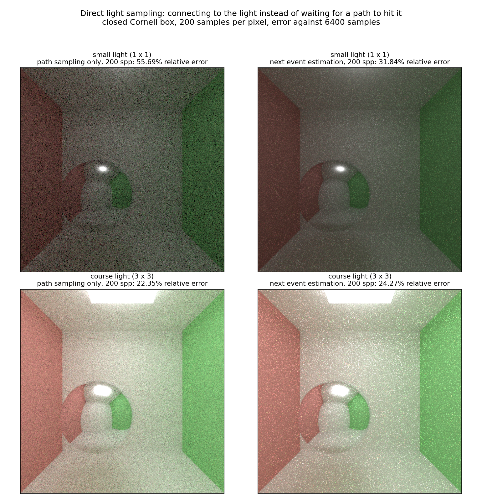

*Closed Cornell box, 200 samples: direct light sampling on a small light
compared with the course scene's larger light.*

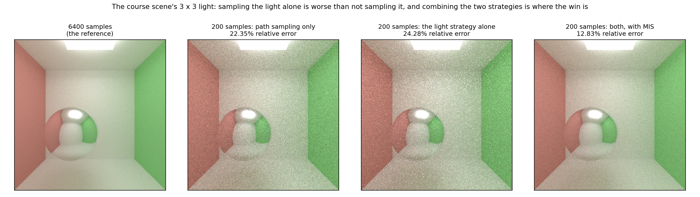

*The course scene's 3x3 light at 200 samples: path sampling, light sampling,
and MIS.*

### Environment, distant, and spherical lights

The renderer supports a three-color sky dome, a distant sun disc, and
spherical area lights sampled over their tangent cone. All three are checked
against closed-form analytic scenes.

**Files:** `src/lights.h`, `src/pathtrace.cu`, `src/scene.cpp`

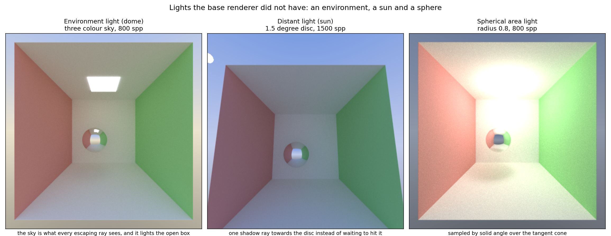

*Sky dome, distant sun, and spherical lamp rendered by the default build.*

### Meshes, BVH, and denoising

Self-contained OBJ and PLY loaders turn meshes into ordinary `TRIANGLE`
geometries, so meshes share the material, transform, texture, and
intersection paths of every other primitive. A binned SAH BVH is built on the
CPU and traversed iteratively on the GPU. Intel Open Image Denoise optionally
filters the accumulation buffer with first-hit normals and albedo.

**Files:** `src/mesh.cpp`, `src/bvh.cpp`, `src/bvh.h`, `src/denoise.cpp`

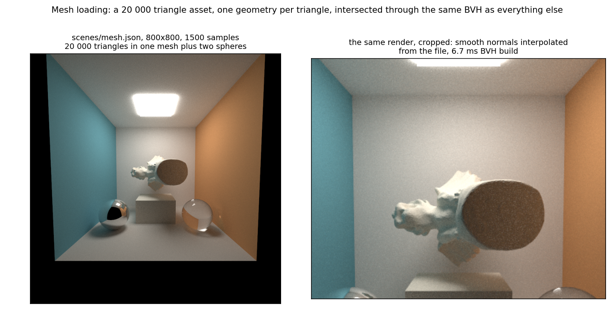

*`scenes/mesh.json`, 800x800, 1500 samples: a 20,000-triangle gargoyle on a
plinth with mirror and glass spheres.*

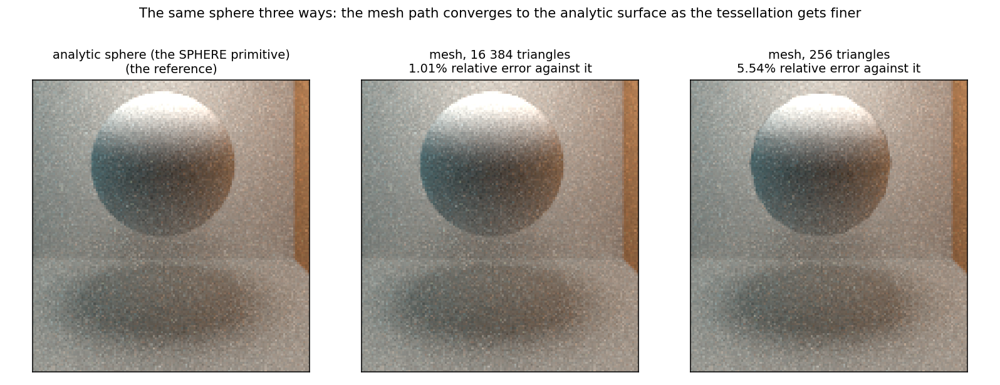

*A mesh sphere converges to the analytic sphere as tessellation increases.*

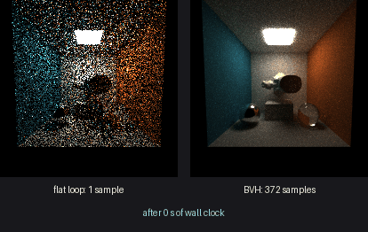

*Flat primitive loop and BVH side by side at the same wall-clock time. The
labels show the real sample counts.*

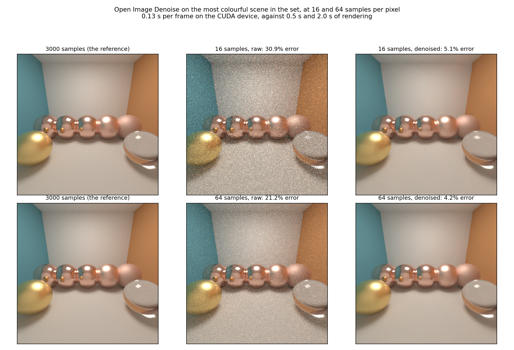

*`scenes/glossy.json`: raw and denoised output with OIDN.*

## Performance Summary

Unless noted otherwise, timings use the RTX 3060 Laptop, Release build,
CUDA 13.3, MSVC 19.51, 800x800, `DEPTH 8`, and interleaved runs of the two
binaries.

### Required analysis: rays remaining per bounce

| Scene | b1 | b2 | b3 | b4 | b5 | b6 | b7 | b8 | b9 |
|---|---:|---:|---:|---:|---:|---:|---:|---:|---:|
| Cornell box (open) + compaction | 81.7% | 56.6% | 43.5% | 34.7% | 28.0% | 22.9% | 18.7% | 15.3% | 0% |
| Closed box + compaction | 99.5% | 97.9% | 96.3% | 94.6% | 93.0% | 91.4% | 89.9% | 88.3% | 0% |
| Either scene, compaction off | 100% | 100% | 100% | 100% | 100% | 100% | 100% | 100% | 100% |

### Required analysis: open vs closed compaction cost

| Scene | Compaction off | Compaction on | Result |
|---|---:|---:|---:|
| Cornell box (open), 500 spp | 24.52 s | **16.15 s** | **1.52x faster** |
| Closed box, 500 spp | 34.17 s | 37.27 s | 0.92x (9% slower) |
| Closed box, 2000 spp | 133.8 s | 144.5-157.0 s | no benefit |

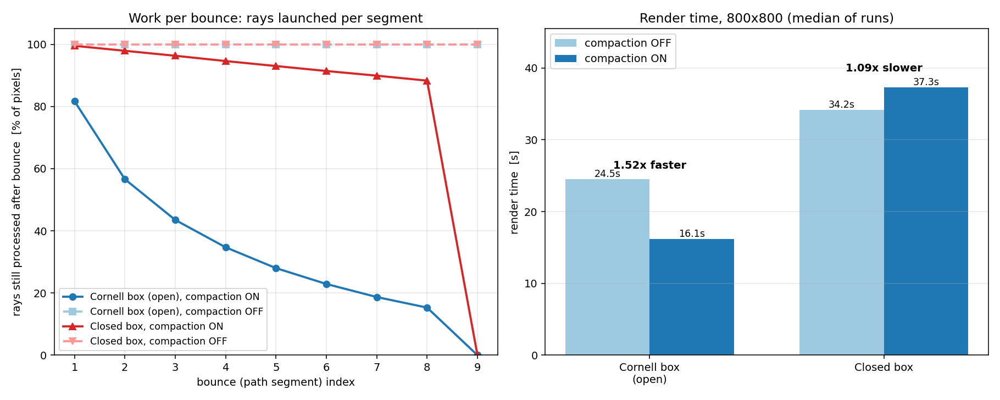

*Left: rays launched per bounce. Right: render time.*

### Sorting by material

| Scene | Bounce | Warps seeing one material before | After sort |
|---|---:|---:|---:|
| `glossy.json`, 13 materials | 1 | 77.6% | 99.8% |
| `glossy.json` | 6 | 0.0% | 98.8% |
| `glass.json`, 9 materials | 1 | 79.4% | 99.9% |
| `glass.json` | 6 | 0.0% | 99.3% |

The sort removes the divergence, but its own passes cost about 0.2 ms at
200x200, 0.5 ms at 400x400, and 1.8 ms at 800x800. At 400x400, shading gains
13% in the best case while the three stages together become 7% slower; at
800x800 the total becomes 17% slower. Sorting is therefore off by default.

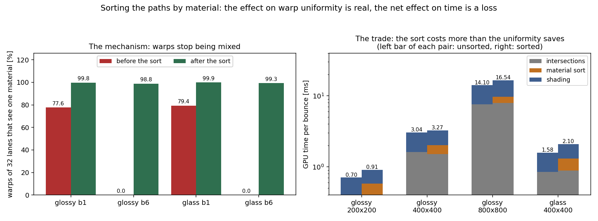

*Left: uniformity bought by the sort. Right: stacked per-bounce stage times.*

### Feature costs

| Feature | Measurement |
|---|---|
| Stochastic AA | 13.7 s vs 13.0 s at 400x400 / 1000 spp, within noise; silhouette RMSE 13.66 with AA vs 138.38 without |
| Depth of field | 18.97 s pinhole vs 19.49 s at aperture 0.5, about +2.7% |
| Procedural shapes | 7.3 s analytic vs 25.4 s SDF; 31.1 s with bounding-sphere culling off, so culling gives 1.22x and is bit-identical |
| Restartable rendering | 0.66 ms device-to-host with pinned memory, about 10.84 GB/s; 5.2 ms per checkpoint including disk write |
| Russian roulette | Closed 16-bounce scene 87.0 s to 45.5 s (1.91x); glass scene 24.8 s to 12.8 s (1.94x) |
| Refraction | Within noise for the BSDF itself; glass needs 1115 path segments per sample at 12 bounces, 384 with roulette |
| GGX | 12.1 s mirror vs 12.2 s GGX at 400x400 / 600 spp; the lobe itself is essentially free |
| Low-discrepancy sampling | Hard-edge silhouette RMSE down 35%; camera-ray cost about +1.6% |
| Direct lighting | Small light error at 200 spp goes from 55.69% to 31.84%; rendering cost rises from 8.07 s to 11.36 s |
| MIS | Large course light error: 22.35% path sampling, 24.28% light sampling alone, 12.83% with MIS |
| Meshes and BVH | 20,009 primitives: intersections 2314.05 ms to 3.03 ms per bounce, full bounce 4538.61 ms to 3.89 ms (1167x) |
| Denoising | 16 samples: 30.9% raw error to 5.1% denoised for an extra 0.13 s; 64 samples: 21.2% to 4.2% |

### Correctness checks

* Stream compaction is a pure optimization: compaction on and off produce a
  bit-identical 800x800 image.
* Material sorting is a permutation: sorting on and off produce bit-identical
  images in the Cornell box, `glossy.json`, and `glass.json`.
* Restartable rendering produces a bit-identical result after interruption.
* The light ledger checks the direct-lighting estimator against the BSDF
  emitter hits it replaces; the 5000-sample open Cornell check agrees within
  0.07% plus or minus 0.09%.
* The BVH is checked against the flat primitive loop on a small scene and
  produces a bit-identical image.

### Validation against the reference image


*The reference image shipped with the base code.*

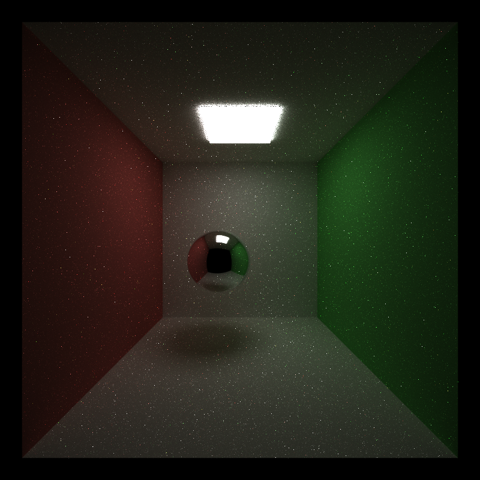

*The renderer reproduces the global illumination: red and green wall bleed,
soft shadowing, and the ceiling light as the only bright emitter. The sphere
is a perfect mirror because its scene material has `ROUGHNESS: 0.0`.*

## Scenes

| Scene | What it is |
|---|---|
| `scenes/sphere.json` | Emissive sphere on a black background, used for noise-free anti-aliasing measurements |
| `scenes/cornell.json` | The supplied open Cornell box |
| `scenes/cornell_closed.json` | Closed Cornell box, used for the stream-compaction comparison |
| `scenes/showcase.json` | The cover image: closed room, ceiling light, mirror spheres, and a diffuse ball |
| `scenes/dof.json` | Depth-of-field scene with `APERTURE` / `FOCUS` |
| `scenes/procedural.json` | Mandelbulb and Menger sponge with procedural textures |
| `scenes/procedural_analytic.json` | Analytic sphere and cube forming the comparison scene for SDF cost |
| `scenes/cornell_closed_deep.json` | Closed Cornell box with `DEPTH` 16, used for Russian roulette |
| `scenes/glass.json` | Glass, water, and mirror spheres in the closed room |
| `scenes/glossy.json` | GGX roughness sweep with copper, gold, and glass |
| `scenes/dome.json` | Open scene lit only by the environment dome |
| `scenes/sunset.json` | Distant sun over the sky gradient |
| `scenes/sphere-light.json` | Spherical emissive body and tangent-cone sampling |
| `scenes/mesh.json` | Gargoyle bust, plinth, mirror sphere, and glass sphere |
| `scenes/materials.json` | Diffuse, mirror, and GGX copper spheres for the BSDF figure |

`assets/meshes/` holds the OBJ files named by `scenes/mesh.json`:
`gargoyle.obj`, `bunny-head.obj`, `cat-head.obj`, `cube.obj`,
`sphere-{fine,coarse}.obj`, and `torusknot.obj`. The large third-party mesh
files are not committed. The cube and UV spheres are generated by
`out/run/make_meshes.py` so that the loader has geometry with an analytic
counterpart. No texture files are required: all textures are procedural.

The two asset scenes rendered at the top of this README are converted the same
way, from the sources credited below:

| Scene | Source | Conversion | Triangles |
|---|---|---|---|
| `out/asset-probe/veach-ajar.json` | `resources/pbrt-v4/veach-ajar.zip` from [Benedikt Bitterli's Rendering Resources](https://benedikt-bitterli.me/resources/) (CC0) | `out/asset-probe/make_veach_ajar.py` parses the pbrt scene graph and bakes each instance's transform into a PLY | 382,688 |
| `out/asset-probe/sponza.json` | `common/model/crytek_sponza/sponza.zip` from [Morgan McGuire's Computer Graphics Archive](https://casual-effects.com/data) | `out/asset-probe/make_sponza.py` splits the OBJ into one PLY per `usemtl` and derives a flat albedo from each diffuse map | 262,267 |

Both scene files are in the gitignored `out/` tree, so they are documented here
rather than linked, and the models stay out of the repository. Two details of
the pbrt conversion are worth recording: the `Transform` before the camera block
is the world-to-camera matrix and is reset at `WorldBegin`, and pbrt's `fov` is
the field of view over the film's *long* axis, so the 35.98 in the scene file is
a 20.72-degree vertical field of view at 16:9.

## Build and Run

Requirements: CMake 3.24 or newer, CUDA, C++17, Windows, GLFW, GLEW, GLM,
and OpenGL. The external dependencies are included in `external/`.

```text
cis565_path_tracer scenes/sphere.json
```

The base repository needs three build fixes for CUDA 13 and MSVC:

1. Make the CUDA toolkit include directories visible to CXX sources.
2. Add `/Zc:preprocessor` for CUDA.
3. Add `/Zc:preprocessor` for CXX.

The `stream_compaction` subdirectory is linked after the Project 2 source
list is enabled. These changes are part of the repository's
`CMakeLists.txt` and `stream_compaction/CMakeLists.txt`.

## Third-Party Code and Credits

* `stream_compaction/{common,efficient}.{h,cu}` is my own Project 2 code; only
  the CUDA error helper was renamed.
* Intel Open Image Denoise is optional, Apache 2.0, and is linked only when
  its prebuilt package is present. The integration in `src/denoise.cpp` is
  mine.
* The OBJ parser, PLY parser, triangle test, and BVH are written here.
* The mesh assets in `assets/meshes/` come from the CG2025 course sample data,
  converted from ASCII USD. Their provenance needs to be confirmed before
  submission, and the large mesh files are not committed.
* **Asset scenes.** `veach-ajar` is by Benedikt Bitterli, released under CC0,
  from [Rendering Resources](https://benedikt-bitterli.me/resources/) (used
  here from the pbrt-v4 pack, which also supplies the Tungsten reference render
  shown above). Crytek Sponza is the model by Frank Meinl (original by Marko
  Dabrovic), distributed through [Morgan McGuire's Computer Graphics
  Archive](https://casual-effects.com/data); the archive asks to be cited as
  "Morgan McGuire, Computer Graphics Archive, July 2017
  (https://casual-effects.com/data)". Neither model nor its textures are
  committed; `out/asset-probe/{make_veach_ajar,make_sponza}.py` regenerate the
  converted PLY files and the scene files from the downloads.
* References used for the shading include PBRT v4 sections 9.2 and 9.3, GPU
  Gems 3 chapter 20, PBRT v4 section 5.2.3, PBRT v3 section 8.2.3, and PBRT
  v4 section 13.7.
* The GGX lobe follows Walter et al. 2007 and PBRT v3 section 8.4, with
  height-correlated masking from Heitz 2014 and visible-normal sampling from
  Heitz, JCGT 2018.
* The low-discrepancy sampler follows Halton 1960 and Cranley-Patterson 1976.
* The procedural shapes follow the published Mandelbulb and Menger distance
  estimators; the tetrahedron normal and value-noise framing follow Inigo
  Quilez's distance-function notes.
